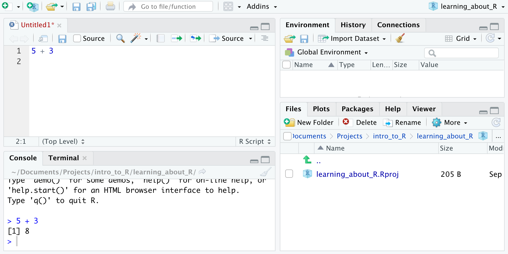

## 0 Installing R and RStudio

First things first, you'll need to download and install R and RStudio on your computer. R is the language and RStudio is the development environment you'll use to run your code, look at your data and visualizations, etc.

[Here](https://courses.edx.org/courses/UTAustinX/UT.7.01x/3T2014/56c5437b88fa43cf828bff5371c6a924/) are some straightforward instructions to download R and RStudio on a Mac or Windows machine. Disregard instructions to install the SDSFoundations package.

### 0.1 Creating a project

You're ready to create your first project! Here's how:

* Decide where you want to hold your work. I'd recommend a new folder maybe called "Intro_R" in your Documents folder.
* Then, open RStudio
* File > New Project > New Directory > New Project
* Name your directory something descriptive like "learning_R"
* Make it a subdirectory of "Documents/Intro_R" or whatever you've created to organize the R project
* Finally, create the project!

### 0.2 Check everything works

Now's a good time to double check that you've followed all the steps correctly. 

* Open a new R Script by going to File > New File > R Script. An R script holds code.
* Type 5 + 3 in your new R script and hit "Run" (or press Command + Enter) in the upper right of the pane.
* If you've done everything right, this should show up in your console:

```{r, eval = F}
# > 5 + 3
# [1] 8
```

The [1] just means that the first (and only) element of the output is 8.

Great job, now you're a programmer! Next we'll learn a little about the RStudio environment you see in front of you (the IDE: Integrated Development Environment).

### 0.3 RStudio IDE

Here's about what your IDE should look like:



**The upper left pane is your R script.** You can write code up here and save it as a document: a script. You can run it by pressing the green arrow that says Run the current line or selection. You can also have multiple tabs at once in this pane: try starting a second R script.

**The lower left pane is your console.** You can type code directly in here to see if it runs. I think of this as my testing ground: I write pieces of code in here, and when I'm sure that it works the way I want it to, I'll copy-paste it up into my R Script.

**The lower right pane is for Files, Plots, Packages, and Help.** 

* The **Files** tab shows you everything you've saved in the Project you made. If you save your R script, it will show up there. 
* The **Plots** tab will automatically open to show you any plots you make. We'll see this a lot in week 3 when we do data visualization with ggplot2!
* The **Packages** tab show you any packages you've downloaded from the web to use with R. The main package we'll be using is a package called `tidyverse`, which is a collection of other packages (including `ggplot2`, `dplyr`, and `purrr`) that work nicely together and help you manipulate data and visualize it in R.
* The **Help** tab brings up help documentation on any function in any package you've downloaded. It's a good idea to make use of this function as much as possible! Before you google your questions, take a little time to read some relevant help docs. It'll slowly get you more comfortable over time with how the language works.
* The **Viewer** tab isn't something we'll use in this course, but you can use it to do things like preview a powerpoint presentation as you're writing it in R.

**The upper right pane is for your Environment, History and Connections.** 

* The **Environment** tells you what variables you've created in your *global environment*. Right now, that environment is empty, so it's blank. Type in your console `x <- 3`. We'll read this as, "x gets 3". You've created a variable with the name `x` and assigned the value 3 to it. You've also saved that variable to your global environment, so that if you continue to refer to x, R knows what you're talking about and will evaluate it like it's equivalent to 3. You should see your Environment is updated with a variable named x, with a type numeric, length 1 (it's actually a vector of length 1), a certain size in memory, and a value of 3.
* The **History** tab shows you commands you've run. It comes with a helpful search bar. It also comes with a little broom icon, which you'll see all over the IDE. Hitting this will clean up the work space. I don't use this very often at all, but if you feel like things are becoming cluttered and it's starting to confuse you, it's nice to start fresh sometimes.
* The **Connections** pane is for connecting to things like databases. We won't get into that in this crash course cause all the data we'll need can easily be downloaded.

Lastly, the header can be a little intimidating at first glance as well, so I'll give you an overview of that.

**File**: 

* New File
  + R Scripts are for writing and saving your code
  + R Markdown is also fantastic if you want to mix text and code in a report (along with images, animations, and whatever else). I've used R Markdown to write this page and all of the lessons in this crash course.
  + Text file can be helpful too.
* Open project: changes which R project you're in
* Open project in new session: opens another RStudio window, so you can have 2 different projects open at once.
* Save: very important! RStudio doesn't crash on me often, but it's always a good idea to save your work frequently. I'll usually just use the keyboard shortcut Command S.

**Edit** 

* Find: (or use keyboard shortcut Command F): find a word in your R script, R markdown file, or text file. It's easy to find and replace one instance or all instances at once. You can also use regular expressions by clicking "Regex" if you know what that is.

**Help**

* `Search` bar for searching help topics
* `Cheatsheets` points you to a couple great resources, also available online at [https://rstudio.com/resources/cheatsheets/](https://rstudio.com/resources/cheatsheets/). Check out the RStudio IDE Cheat Sheet right now!

### 0.4 Packages

R comes pre-loaded with a couple packages that have lots of useful functions.

One of these packages is called `base`. You'll use functions from `base` all the time to do basic things like arithmetic in R.

For instance, `base` includes a function called `log` that you can use to take the log of a number. When you use `log`, you can refer to it in 2 different ways:

```{r, eval = F}
# First way: just use the name of the function
log(5)
#> [1] 1.609438

# Second way: use the name of the package it comes from as well. If you've downloaded a second package also with a function called `log`, this way makes sure you're using the function from the base package.
base::log(5)
#> [1] 1.609438
```

### Exercise 1: use base::Arithmetic to get R to do multiplication for you

* Run `?Arithmetic` or `?base::Arithmetic` in your console to figure out how to multiply 12309 and 983.

#### Answer

```{r, eval = F}
# Add spaces or don't: R will ignore your white space.
12309*983
#> [1] 12099747
12309 * 983
#> [1] 12099747
```

`stats` is another function that comes pre-loaded into R. It comes with all kinds of distributions and functions that are useful for stats.

A function that I use all the time is `stats::rnorm`. It generates random numbers from a normal distribution.

```{r}
# Generate 5 random numbers from a normal distribution with a mean of 50 and standard deviation of 10:
rnorm(n = 5, mean = 50, sd = 10)
```

The package `stats` even has functions that solve the famous birthday paradox for you!

### Exercise 2: 

Use `stats::pbirthday` to find the probability that with a group of 30 people, 2 people have the same birthday. How about 3 people? Run `?pbirthday` in your console to access the help documentation and find out how to use the `pbirthday` function.

#### Answer:

```{r}
pbirthday(n = 30)
```

Yep, the probability that 2 people in a room of 30 will have the same birthday is greater than 70%!

```{r}
pbirthday(n = 30, coincident = 3)
```

### 0.5 Packages from the web

Now let's add some more packages! 

There's a simple, quick, 2 step process to getting started with a new package in R:

1. install it with `install.packages("package_name_here")`
2. load it into the R session with `library(package_name_here)`

Then you're ready to go!

Let's practice with a package you'll be using a lot. It's called `tidyverse`, and it's actually a bundle of useful packages we'll learn about later, including `dplyr`, `ggplot2`, and `purrr`.

Run the `install.packages()` function like this, with `tidyverse` in quotes. Usually you don't need dependencies to be TRUE, but if you get errors, this is a good move to troubleshoot.

```{r, eval = F}
install.packages("tidyverse", dependencies = TRUE)
```

Now load it using `library()`, and `tidyverse` not in quotes this time:

```{r, eval = F}
library(tidyverse)
```

Now you're ready to start using functions from `tidyverse`! When you close and reopen RStudio in a new session, you won't have to install the tidyverse again (it's already installed on your computer), but you will have to load it into the session again. So next time, all you need to do is say `library(tidyverse)` to use tidyverse functions next time.

### Exercise 3: install and load another package

Install and load a package called `gapminder`. I'll be using the sample dataset in `gapminder` a lot while we learn R basics. It has historical census-type information from around the world.

#### Answer

```{r, eval = F}
install.packages("gapminder")
library(gapminder)
```

Test that you've properly installed and attached `tidyverse` and `gapminder` by running this code:

```{r, eval = F}
# Use `head()` to see the first 6 rows of the dataset
head(gapminder)

# Use `tail()` to see the last 6
tail(gapminder)

# Use `tidyverse::filter()` to keep only the observations with the highest life expectances (lifeExp greater than 81)
filter(gapminder, lifeExp > 81)
```

You can also take a look at the entire dataset by opening a new tab to view it with a function `View()`:
```{r, eval = F}
View(gapminder)
```

### 0.6 R markdown

One final package to install and attach is `rmarkdown`. Like I said before, R Markdown is a great tool for creating beautiful reports that mix text, code, images, and whatever else you want.

Run this code to start using R Markdown:

```{r, eval = F}
install.packages("rmarkdown", dependencies = TRUE)
library(rmarkdown)
```

> **[Learn more about R Markdown](https://r4ds.had.co.nz/r-markdown.html)**
    
 * Each week, download the current version of my **RCheatSheet.Rmd** file.
    + Move that .Rmd file to the same folder as your new R project.
    + From RStudio, in the lower righthand corner you should see a box with the tab "Files". Select **RCheatSheet.Rmd**.
    + Check: can you **Knit** my .Rmd to html? You're ready to go!
 
 * In class, I'll share my screen as I talk through the .Rmd document. You'll answer questions anonymously on [ahaslides](https://ahaslides.com/METRICS).

 * If you want a pdf of your .Rmd (like when you're submitting your assignments to Ed), select the arrow next to "Knit" and hit **"Knit to PDF"**. You'll need to install LaTeX on your computer to do this. RStudio should prompt you with instructions, but [this page from Ed](http://edrub.in/ARE212/latexKnitr.html) might be helpful too.

## 1 Load data from `gapminder`

At the beginning of EVERY CLASS, run this code chunk in your console to attach the packages we'll be using!

```{r pacman, message=F}
# Load/install packages.
if (!require("pacman")) install.packages("pacman")
pacman::p_load(gapminder, skimr, tidyverse, pdist, StatMatch, huxtable, estimatr, furrr)
```

> **Tip:** Use `search()` in your console to see currently attached packages

Reading in different types of data as tibbles:

* csv: comma-separated values use `readr::read_csv()`
* excel files: use `readxl::read_excel()`
* .dta from STATA: use `haven::read_dta()`

## 2 Exploring the data

First install required packages: `?gapminder` is our dataset, `?skimr` is a fun data summary tool, and `?tidyverse` includes a bunch of packages used in data analysis like `?dplyr` and `?ggplot2`. 

You can copy-paste the `if(!require("pacman"))`... code chunk into your console. Simply knitting this .rmd file does not make changes to your own environment.

### 2.1 Exploration

Try these for yourself:

 - `View(gapminder)`
 - `?gapminder`
 - `colnames(___)`
 - `head(___)`
 - `tail(___, n = 15)`
 - `class(___)`
 - `str(___)`
 - `dim(___)`
 - `nrow(___)`
 - `summary(___)`
 - `skimr::skim(___)`

### 2.2 Vectors and Matrices

```{r explore_vec, vectors_matrices, eval = F}
# Assign the number 11 to the name `x` in your global environment
x <- 11

# Create a vector: combine x, 2*x, and x^2 with the c() function
  # name that vector `y`
y <- c( x, 2*x, x^2 )

# Assign names to the vector:
names(y) <- c("x", "x times 2", "x squared")

# Create a matrix: combine vectors
  # bind y with y-5
mat_row <- rbind(y, y-5)
mat_col <- cbind( y, y-5)

# Re-assign a matrix column names:
colnames(mat_row) <- c("x", "x times 2", "x pow 2")
```


### 2.3 Rename columns

```{r explore_colnames}
# The column names of the data frame `gapminder` is a vector.
colnames(gapminder)
```

Let's change the column names: 
- Change lifeExp to be life_exp, and gdpPercap to be gdp_per_cap.
How?
  - Use `c()` to make a vector of the column names you want.
  - Put quotations around character strings
  - Then reassign `colnames(gapminder)` to be that new vector.

```{r, eval = F}
colnames(gapminder)[c(4, 6)] <- c("life_exp", "gdp_per_cap")
# check your answer:
colnames(gapminder)
```

Now reset the column names by removing `gapminder` from your environment and re-attaching the package:

```{r, eval = F}
rm(gapminder)
library(gapminder)
```

## 3 Selecting data

### 3.1 Select values

```{r select_obs, eval = F}
# Select the population of Afghanistan in 1952
  # How?
    # Use `head(gapminder)` to find the row __, column __ of the data.
    # To select the element in the 3rd row, 2nd column of a matrix, use my_matrix[3, 2]. As an aside, to select the 10th element of a vector, use my_vector[10].

gapminder[1, 5]
```


> **Note:** select value ranges with `gapminder[1:10, 3]`.

### 3.2 Select columns

```{r select_cols, eval = F}
# Select the entire first column 'country' in gapminder
  # How?
    # my_matrix[, 10] selects all rows of the 10th column
    # my_matrix[10, ] selects the 10th row of all columns

gapminder[, 1]
```


```{r select_cols2, eval = F}
# R allows you to extract a named column with the `$` operator
gapminder$country

# You can also use the function `select` from the `dplyr` package.
  # `dplyr::select`
select(gapminder, country)
```

### 3.3 Select Rows

```{r select_rows, eval = F}
# Select all rows with data from the United States
  # You can use [] as we practiced with column selection
  # But which rows do we need? Which rows have US data?

# `dplyr::filter` comes in handy
  # `filter(data, logical)`
  # `filter` scans the data frame and returns rows where the logical statement is TRUE.

filter(gapminder, country == "United States") #`==` reads "is equal to".
```

> **Note:** `country` doesn't need quotes and `"United States"` does. `country` is the name of our column and we want R to recognize it as that special object, not just a string of characters. `"United States"` however doesn't represent any special object, it's just a character string. That is, we don't want R to go looking for what `"United States"` represents, because it won't find anything! Also, `"United States"` would be a terrible name for an object, since spaces aren't allowed in object names.

## 4 Handy logical operators

 - `==`: is equal to
 - `!=`: is not equal to
 - `>, <, >=, <=`
 - `&`: and
 - `|`: or
 - `%in%` : in
 - Need a "not in"? Define it for yourself: `%nin%` <- Negate(`%in%`)

examples:

 - `country == "United States"`
 - `gdpPercap >= 8000`
 - `country %in% c("United States", "Germany", "Brazil")`
 - `country == "United States" | country == "Germany" | country == "Brazil"`
 - `pop > 1000000 & year == 1952`

### 4.1 `filter()` practice

```{r more_filter, eval = F}
# 4.1.1: Filter all rows with lifeExp greater than or equal to 78

filter(gapminder, lifeExp >= 78)

# 4.1.2: Filter all rows with lifeExp greater than or equal to 78 with continent the "Americas"

filter(gapminder, lifeExp >= 78 & continent == "Americas")
# As Connor pointed out, this is equivalent:
  # filter(gapminder, lifeExp >= 78, continent == "Americas")  
```


### 4.2 The Pipe Operator `%>%`

Piping helps when your code has several steps. It's a function from `magrittr`, but it's included in `dplyr`, so it's also in the `tidyverse`.

```{r pipe, eval = F}
# Say we want to filter on year == 2007.

filter(gapminder, year == 2007)

  # The console will automatically print the first 10 rows out of 132.
  # If we want to see the first 20 rows instead, we could wrap `filter()` with head(___, n = 20)

head(filter(gapminder, year == 2007), n = 20)

  # But wrapping functions in other functions starts to be confusing to read the more functions you have. You have to read the code inside-out.
  # This code is equivalent (read %>% as "then"):

gapminder %>%
  filter(year == 2007) %>%
  head(n = 20)

  # The pipe operator takes whatever comes before it and makes it the first argument in the function that follows it. So `gapminder` is the first argument in `filter()`, and the filtered version of `gapminder` is the first argument in `head()`. Notice that the code now makes sense read left to right, top to bottom.
```


### 4.3 Resources

 - [More on data types, filter(), select(), and logical operators from R4DS](https://r4ds.had.co.nz/transform.html)
 - [Data import from R4DS](https://r4ds.had.co.nz/data-import.html)

## 5 Data Visualization and `ggplot2`

`ggplot2` is a package included in the `tidyverse`. You can use it to build beautiful and very customizable plots.

Today we'll learn `ggplot2` basics:

- take data and build a scatterplot
- customize the plot with titles, labels, and themes
- fit a line to the data
- work with things called aesthetic mappings, scales, and more!

```{r, eval = F}
# Packages you'll need for this lesson:
library(gapminder)
library(tidyverse)
```

### 5.1 Basic plot: `ggplot() + geom_point()`

Take some data and build a scatterplot.

```{r out.width= "40%", out.extra='style="float:right"'}
ggplot(data = gapminder) +
  geom_point(mapping = aes(x = gdpPercap, y = lifeExp))
```

Run `?ggplot` in your console to see the help docs for ggplot. There's a lot of info there. We learn:

* `ggplot()` initializes a ggplot object.
* the argument `data` needs a `"data.frame`" object. We're in luck, because `gapminder` is a `"tbl"` and a `"data.frame"`.

Then we'll add `+` `geom_point()` to draw a scatterplot:

* We could have used lots of other `geoms`: there's `geom_line()`, `geom_boxplot()`, `geom_histogram()`, etc. We'll get to those later.
* The first `aes`thetic mapping we'll do is to map the variable `lifeExp` to the **x-axis** and `gdpPercap` to the **y-axis** of our plot.
* An `aes`thetic mapping takes a variable in the `data` and maps it to an `aes`thetic in the plot.

```{r, eval = F}
# Note: I'll take advantage of positional matching to make my code easier to read sometimes:
ggplot(gapminder) +
  geom_point(aes(x = gdpPercap, y = lifeExp))
```

#### {.tabset .tabset-fade .tabset-pills}

##### Exercise

> **Exercise 1**: Draw a scatterplot that plots `year` on the x-axis and `lifeExp` on the y-axis. Does it seem like countries have had higher life expectancies over time?

##### Answer

```{r, eval = F}
# Exercise 1 answer
ggplot(gapminder) +
  geom_point(aes(x = year, y = lifeExp))
```

```{r out.width= "50%", out.extra='style="float:left"'}
# Actually using `geom_boxplot()` makes more sense and is more visually informative. 
ggplot(gapminder) +
  geom_boxplot(aes(x = as.factor(year), y = lifeExp))
```

Note that we have to set `x = as.factor(year)` instead of just `x = year`. This coerces the variable `year` to be a factor (categorical data type).

##

<br><br>

### 5.2 Add labels: `+ labs()`

Next we'll add a title and adjust the labels on the x- and y-axis.

```{r out.width= "40%", out.extra='style="float:right"'}
ggplot(gapminder) +
  geom_point(aes(x = gdpPercap, y = lifeExp)) +
  labs(
    title = "GDP per capita correlates with life expectancy", 
    x = "GDP/capita", 
    y = "life expectancy"
    ) +
  theme(text = element_text(size = 10))
```

Check out `?labs`:

* `labs()` arguments:
  + `...` : a list of name-value pairs where name is an `aes`thetic. We use the fact that `x` and `y` are plot `aes`thetics, and we give them values `"GDP/capita"` and `"life expectancy"`.
  + `title`: we set as `"GDP per capita correlates with life expectancy"`
  + `subtitle`
  + `caption`
  + `tag`

Good titles explain something about what your plot means. However, that oftentimes leads to long titles. Since my title was running off the page, I decided to adjust the global font size. I did that with the `theme()` call.

See the next section for more info on `theme()`!

#### {.tabset .tabset-fade .tabset-pills}


##### Exercise

> **Exercise 2**: Take the `life expectancy over year` boxplot from the answer to Exercise 1 and add a title, caption, and tag.

##### Answer

```{r out.width= "50%"}
# Exercise 2 answer
ggplot(gapminder) +
  geom_boxplot(aes(x = as.factor(year), y = lifeExp)) +
  labs(title = "Global life expectancy is leveling off", caption = "data: gapminder", tag = "Week 3")
```

### 5.3 More `theme()`

```{r out.width= "40%", out.extra='style="float:right"'}
ggplot(gapminder) +
  geom_point(aes(x = gdpPercap, y = lifeExp)) +
  labs(
    title = "GDP per capita correlates with life expectancy", x = "GDP/capita", y = "life expectancy") +
  theme(
    text = element_text(size = 10, color = "purple"),
    rect = element_rect(fill = "pink"),
    line = element_line(color = "black", size = 3),
    panel.background = element_rect(fill = "green")
    )
```

What else can we do with `theme()`? Check out `?theme`

* There's a *ton of arguments*.
* The main ones are the first 3: `line`, `rect`, and `text`.
  + Other arguments inherit elements from these first arguments.
  + For example, we made all the text in our plot purple and point size 10 when we did this: `text = element_text(size = 10, color = "purple")`
  + If you only wanted to make the title size 10 and purple, you could instead do this: `plot.title = element_text(size = 10, color = "purple")`.
  + But if `plot.title` is left unspecified, it will inherit elements from `text`.
* The exception is that `panel.background` doesn't inherit like it should from `rect`. It's a [bug](https://github.com/tidyverse/ggplot2/issues/880).
* As you can see, it's easy to create some **awful** looking things. So for now we'll use a preset theme. Type in your console `theme_` to see the options `ggplot2` has.

### 5.4 Presets: `theme_*`

```{r}
my_simple_plot <- gapminder %>%
  ggplot() +
  geom_point(aes(x = gdpPercap, y = lifeExp)) +
  labs(x = "GDP/capita", y = "life expectancy")
```

#### `theme_bw()`
```{r, out.width= "40%"}
my_simple_plot +
  theme_bw()
```

#### `theme_minimal()` 
```{r, out.width= "40%"}
my_simple_plot +
  theme_minimal()
```
 
#### `theme_void()`
```{r, out.width= "40%"}
my_simple_plot +
  theme_void()
```

### 5.5 Fit a line: `+ geom_smooth()`

```{r, message = F, out.width= "50%", out.extra='style="float:right"'}
ggplot(gapminder) +
  geom_point(aes(x = gdpPercap, y = lifeExp)) +
  labs(x = "GDP/capita", y = "life expectancy") +
  theme_minimal() +
  geom_smooth(aes(x = gdpPercap, y = lifeExp)) # 👈 😑 👈 
```

`geom_smooth()` does smoothed conditional means. Here, it adds another layer of graphics on top of the scatterplot.

* Check out `?geom_smooth`
* Use `geom_smooth(method = lm)` to get a straight line (OLS)

Any `geom` will inherit `data` and also `aes`thetic mappings from the `ggplot` call. So for cleaner looking code I can write this:
  
```{r, eval = F}
ggplot(gapminder, aes(x = gdpPercap, y = lifeExp)) +
  geom_point() +
  labs(x = "GDP/capita", y = "life expectancy") +
  theme_minimal() +
  geom_smooth() # 👈 😮 👈 
```


### 5.6 Scales: `scale_x_log10()`

The scatterplot is fan-shaped, which is a sign you might want to take the log of one (or both) of the axes. Here are 2 techniques that will lead to almost the same result.

```{r, message = F, fig.show = "hold", out.width = "50%"}
# Take the log of the variable: aes(log10(gdpPercap))
ggplot(gapminder, aes(x = log10(gdpPercap), y = lifeExp)) + # 👈 😀 👈 
  geom_point() +
  labs(x = "log GDP/capita", y = "life expectancy") +
  theme_minimal() +
  geom_smooth(method = lm)

# Rescale with `+ scale_x_log10()`
ggplot(gapminder, aes(x = gdpPercap, y = lifeExp)) +
  geom_point() +
  labs(x = "GDP/capita", y = "life expectancy") +
  theme_minimal() +
  geom_smooth(method = lm) +
  scale_x_log10(labels = scales::comma) # 👈 😀 👈 
  # use labels = scales::comma to suppress scientific notation here
```

> Note the difference in the breaks on the x-axis. log10(1000) = 3, but log GDP/cap = 3 is harder to decipher than GDP/cap = 1,000.


### 5.7 Color to represent `continent`

Next I want to color the points by continent. That's another `aes`thetic mapping. Just like `gdpPercap` is mapped to `x` and `lifeExp` is mapped to `y`, we can map `continent` to `color`.

```{r, message = F}
# geom_point(aes(color = continent))
ggplot(gapminder, aes(x = gdpPercap, y = lifeExp)) +
  geom_point(aes(color = continent)) + # 👈 😍 👈 
  labs(x = "GDP/capita", y = "life expectancy") + 
  theme_minimal() +
  geom_smooth(method = lm) + 
  scale_x_log10(labels = scales::comma)
```


####  {.tabset .tabset-fade .tabset-pills}

##### Exercise

> **Exercise 3**: Instead of mapping `continent` to `color`, map `continent` to `shape`. What's the default `shape` scale?

##### Answer

```{r, message = F}
# Exercise 3 answer
ggplot(gapminder, aes(x = gdpPercap, y = lifeExp)) +
  geom_point(aes(shape = continent)) + # 👈 😍 👈
  labs(x = "GDP/capita", y = "life expectancy") + 
  theme_minimal() +
  geom_smooth(method = lm) + 
  scale_x_log10(labels = scales::comma)
```

### 5.8 Color to fixed value

Suppose instead of mapping `continent` to `color`, I wanted to color **all the dots pink**. That's not an `aes`thetic mapping because you're not taking information in the data and representing it with `aes`thetics in the plot. You'll implement this by writing `color = "pink"` in the `geom_point()` call, but not wrapped with `aes()`.

```{r, message = F}
# geom_point(color = "pink")
# color also takes hexadecimal colors like "#4fc4ab"
ggplot(gapminder, aes(x = gdpPercap, y = lifeExp)) +
  geom_point(color = "pink") + # 👈 😜 👈
  labs(x = "GDP/capita", y = "life expectancy") + 
  theme_minimal() +
  geom_smooth(method = lm, color = "gray") + 
  scale_x_log10(labels = scales::comma)
```


<br><br>

### 5.9 Adjust color scale: `scale_color_manual()`

Go back to mapping continent to color. Say I don't like this default color scale. That's another `scale` I can adjust.

```{r, message = F, out.width= "40%", out.extra='style="float:left"'}
ggplot(gapminder, aes(x = gdpPercap, y = lifeExp)) +
  geom_point(aes(color = continent)) +
  labs(x = "GDP/capita", y = "life expectancy") + 
  theme_minimal() +
  geom_smooth(method = lm, color = "black") + 
  scale_x_log10(labels = scales::comma) +
  scale_color_manual(values = c("#e3a446", "#6187cf", "#699e4a", "#db502a", "#3b3078")) # 👈 🤓 👈
```

`continent` is a `factor` variable with 5 `levels`, so I'll need to pick out 5 colors.

```{r, eval = F}
class(gapminder$continent)
## [1] "factor"
gapminder$continent %>% levels() 
## [1] "Africa"   "Americas" "Asia"     "Europe"   "Oceania"
```

Go [here](http://www.stat.columbia.edu/~tzheng/files/Rcolor.pdf) to pick out colors by name, like `"ivory3"`.

I prefer to just google "color picker" and use the widget thing there to get hex codes like "#553469".


#### {.tabset .tabset-fade .tabset-pills}

##### Exercise

> **Exercise 4**: Instead of using `aes(color = continent)` and adjusting the color scale, use `aes(color = continent, shape = continent)` and adjust the shape scale along with the color scale. Try `scale_shape_manual()`.

##### Answer

```{r, message = F}
# Exercise 4 answer
## Instead of `color`, I did `fill`!
ggplot(gapminder, aes(x = gdpPercap, y = lifeExp)) +
  geom_point(aes(fill = continent, shape = continent)) +  # 👈 🤓 👈
  labs(x = "GDP/capita", y = "life expectancy") + 
  theme_minimal() +
  geom_smooth(method = lm, color = "black") + 
  scale_x_log10(labels = scales::comma) +
  scale_fill_manual(values = c("#e3a446", "#6187cf", "#699e4a", "#db502a", "#3b3078")) +  # 👈 🤓 👈
  scale_shape_manual(values = c(21, 22, 23, 24, 25)) # 👈 🤓 👈
```

### 5.10 Adjust transparency: `alpha`

Whenever points overlap a lot like this, it's a good idea to try adjusting the transparency of the points. We can do that by setting `alpha`. `alpha` must be a number between 0 and 1. The default is 1, and the closer it is to 0, the more transparent the points are.

```{r, message = F}
# Since we want alpha to be set the same for all points, we put it outside the aes() call.

ggplot(gapminder, aes(x = gdpPercap, y = lifeExp)) +
  geom_point(aes(color = continent), alpha = .6) + # 👈 😀 👈 
  labs(x = "GDP/capita", y = "life expectancy") + 
  theme_minimal() +
  geom_smooth(method = lm, color = "darkgray") + 
  scale_x_log10(labels = scales::comma) +
  scale_color_manual(values = c("#e3a446", "#6187cf", "#83b543", "#db502a", "#3b3078"))
```

### 5.11 Point `size`

Now I want to adjust the size of the points. Let's make all the points larger then smaller. To affect all points, I'll put `size` outside of the `aes()` call.

```{r, message = F, fig.show = "hold", out.width = "50%"}
# huge: size = 3
ggplot(gapminder, aes(x = gdpPercap, y = lifeExp)) +
  geom_point(aes(color = continent), alpha = .6, size = 3) + # 👈 🙃 👈 
  labs(x = "GDP/capita", y = "life expectancy") + 
  theme_minimal() +
  geom_smooth(method = lm, color = "darkgray") + 
  scale_x_log10(labels = scales::comma) +
  scale_color_manual(values = c("#e3a446", "#6187cf", "#83b543", "#db502a", "#3b3078"))

# tiny: size = .5
ggplot(gapminder, aes(x = gdpPercap, y = lifeExp)) +
  geom_point(aes(color = continent), alpha = .6, size = .5) + # 👈 🙃 👈 
  labs(x = "GDP/capita", y = "life expectancy") + 
  theme_minimal() +
  geom_smooth(method = lm, color = "darkgray") + 
  scale_x_log10(labels = scales::comma) +
  scale_color_manual(values = c("#e3a446", "#6187cf", "#83b543", "#db502a", "#3b3078"))
```

### 5.12 Map `pop` to `size` 

I can also map population to size, so big countries get big points and small countries get small points. To do that, I'll put `size = pop` in the `aes()` call!

```{r, message = F}
# Notice: now we have 2 legends, one for each extra `aes`thetic mapping.
ggplot(gapminder, aes(x = gdpPercap, y = lifeExp)) +
  geom_point(aes(color = continent, size = pop), alpha = .6) + # 👈 😏 👈 
  labs(x = "GDP/capita", y = "life expectancy") + 
  theme_minimal() +
  geom_smooth(method = lm, color = "darkgray") + 
  scale_x_log10(labels = scales::comma) +
  scale_color_manual(values = c("#e3a446", "#6187cf", "#83b543", "#db502a", "#3b3078"))
```

### 5.13 Faceting: `facet_wrap()`

We're nearly done for today! One of the last things we'll talk about is faceting. Notice we have all the years of data mashed into one plot here? Suppose I wanted to draw a different plot for each `year` in the dataset. There's a way to quickly do that, and it's called faceting.

```{r, fig.width= 8, fig.height=6, message = F}
ggplot(gapminder, aes(x = gdpPercap, y = lifeExp)) +
  geom_point(aes(color = continent, size = pop), alpha = .6) + 
  labs(x = "GDP/capita", y = "life expectancy") + 
  theme_minimal() +
  geom_smooth(method = lm, color = "darkgray") + 
  scale_x_log10(labels = scales::comma) +
  scale_color_manual(values = c("#e3a446", "#6187cf", "#83b543", "#db502a", "#3b3078")) +
  facet_wrap(facets = vars(year)) # 👈 😲 👈
```

#### {.tabset .tabset-fade .tabset-pills}

##### Exercise

> **Exercise 5**: Use `facet_wrap()` to facet by `continent` instead of `year`. If you wanted to see growth in GDP/capita and life expectancy over time, how would you visualize it here?

##### Answer

```{r, message = F}
# Exercise 5 answer
## I mapped `year` to `color`: light blue dots are more recent. Life expectancy has increased significantly in the Americas and Asia.
ggplot(gapminder, aes(x = gdpPercap, y = lifeExp)) +
  geom_point(aes(color = year, size = pop), alpha = .6) + # 👈 😲 👈
  labs(x = "GDP/capita", y = "life expectancy") + 
  theme_minimal() +
  geom_smooth(method = lm, color = "darkgray") + 
  scale_x_log10(labels = scales::comma) +
  facet_wrap(facets = vars(continent)) # 👈 😲 👈
```

### 5.15 Animation: `gganimate::transition_states()`

Finally, instead of breaking out into many plots, we overlay the plots and create an animation! I use `gganimate::transition_time` here, and I also decided to replace `geom_point()` with `geom_text()`.

```{r, eval = F}
library(gganimate)
library(transformr)

ggplot(gapminder, aes(x = gdpPercap, y = lifeExp)) +
  geom_text(aes(label = country, color = continent, size = pop), alpha = .6) + 
  labs(x = "GDP/capita", y = "life expectancy") + 
  theme_minimal() +
  geom_smooth(method = lm, color = "darkgray") + 
  scale_x_log10(labels = scales::comma) +
  scale_color_manual(values = c("#e3a446", "#6187cf", "#83b543", "#db502a", "#3b3078")) +
  transition_time(year) + # 👈 🤯 👈
  labs(title = "Year: {frame_time}")
```

### Review

We've covered a lot of ground! Here are the things we've learned:

* `ggplot()` takes `data` and `aes`thetic mappings like x, y, color, and size, and uses `geom`s to draw plots
* We saw these `geom`s:
  + `geom_point()`
  + `geom_boxplot()`
  + `geom_smooth()`
  + `geom_text()`
* We learned how to change titles and labels using `labs()`
* We learned how to adjust scales, like the x-axis scale with `scale_x_log10()` and the color scale with `scale_color_manual()`
* We learned some extra customization using `theme()`, faceting using `facet_wrap()`, and animation using `gganimate`!

### Resources

* [Find the full list of geoms here](https://ggplot2.tidyverse.org/reference/)

* [A Layered Grammar of Graphics](https://vita.had.co.nz/papers/layered-grammar.pdf) 

* [R4DS on Data Visualization](https://r4ds.had.co.nz/data-visualisation.html)

<br><br><br>

### Assignment: get to know more `geom`s

<br>

#### 1 `geom_line()` {.tabset .tabset-fade .tabset-pills}

Use the `gapminder` package to draw a **line plot** showing how `lifeExp` has changed over time for a few different countries.

##### Hints

Use this as a guide:
```{r, eval = F}
# Hints
gapminder %>%
  filter(country %in% c("___", "___", "___")) %>%
  ggplot(aes(x = year, y = ___, color = ___)) +
  geom_line()
```

##### Answer

```{r, message = F}
# Assignment 3.1 Answer
## I wanted the legend to be in the same order as the lines, so I
## used `fct_reorder2()`. It reorders the factor `gapminder$country` 
## so that levels reflect the magnitude of the last pair of 
## (year, lifeExp) coordinates. You can also try `first2`.
gapminder %>%
  filter(country %in% c("Singapore", "Spain", "Iceland", "Italy", "Isreal", "Korea, Rep.")) %>%
  ggplot(aes(x = year, y = lifeExp, color = country %>% fct_reorder2(.x = year, .y = lifeExp, last2))) +
  labs(color = "country") +
  geom_line()
```

<br>

#### 2 `geom_bar()` and `geom_histogram()` {.tabset .tabset-fade .tabset-pills}

Use `geom_bar()` to make a bar plot, then use `geom_histogram()` to make a histogram. 

What's the difference? Bar plots take **categorical** data like `country` and `continent`, while histograms take **continuous** data like `gdpPercap` and `lifeExp`.

For your bar plot, compare the number of observations in the data for each continent.

For your histogram, compare the frequency of observations with gdpPercap inside some intervals. Use only data from 2007.

##### Hints

Use these as guides:
```{r, eval = F}
# Bar plot hint:
gapminder %>%
  ggplot() +
  geom_bar(aes(x = ___)) # No `y = ` here: y will be `count`.

# Histogram hint:
gapminder %>%
  filter(___) %>%
  ggplot() +
  geom_histogram(aes(x = ___)) # No `y = ` here: y will be `count`.
```

##### Answer

```{r, message = F}
# Assignment 3.2 Answer
## Bar plot
### I used `fct_infreq()` to rearrange the bars by frequency and also added color using `fill`.
gapminder %>%
  ggplot() +
  geom_bar(aes(x = fct_infreq(continent), fill = continent))

## Histogram
### rescale the x-axis when working with the `gdpPercap` variable
### to see more detail, as we did above
gapminder %>%
  filter(year == 2007) %>%
  ggplot() +
  geom_histogram(aes(x = gdpPercap, fill = continent), bins = 10) +
  scale_x_log10()

## `geom_density()` does something similar with the argument `y = ..count..`
gapminder %>%
  filter(year == 2007) %>%
  ggplot() +
  geom_density(aes(x = gdpPercap, fill = continent, y = ..count..), alpha = .3) +
  scale_x_log10()
```

<br>

#### 3 `geom_abline()`, `geom_vline()`, and `geom_hline()` {.tabset .tabset-fade .tabset-pills}

You can use these three `geom`s to add straight lines to your plot. Take the histogram you drew in 3.2 and add a vertical line with `geom_vline()` at the international poverty line, currently set at \$1.90 per day (\$693.50 per year).

##### Hints

Use this as a guide:
```{r, eval = F}
gapminder %>%
  filter(___) %>%
  ggplot() +
  geom_histogram(aes(x = ___)) +
  geom_vline(xintercept = ___)
```

##### Answer

```{r, message = F}
# Assignment 3.3 Answer
## I also used `annotate()` to label the poverty line
gapminder %>%
  filter(year == 2007) %>%
  ggplot() +
  geom_histogram(aes(x = gdpPercap, fill = continent), bins = 10) +
  scale_x_log10() +
  geom_vline(xintercept = 693.5) +
  annotate("text", x = 693.5 - 170, y = 12.5, label = "International Poverty Line", angle = 90)
```

## 6 Data manipulation with `dplyr`

> **Note**: run this code chunk in your console if you're picking up here in a new session.
```{r, eval = F}
library(tidyverse)
library(gapminder)
```

`dplyr` "verbs" (functions) we've already learned:

* `select()`: select columns by name
  + `select(gapminder, country, continent, year)`
* `filter()`: select rows by logical conditions
  + `filter(gapminder, continent == "Americas")`

Now we'll learn the rest:

* `mutate()`
* `arrange()`
* `summarize()`
* `group_by()`

### 6.1 `mutate()`

Use `mutate()` to append your data with new variables.

```{r dplyr-mutate, eval = F}
# Create a new variable and call it `total_gdp`
mutate(gapminder, total_gdp = pop*gdpPercap)
```

When you write `total_gdp = population*gdpPercap`, R assigns the name `total_gdp` to `population*gdpPercap`. We could use `<-`, but it's my habit to use `<-` outside of functions and `=` inside of functions. We'll talk more about this in our Functions unit.

> **Note** mutate() will print the mutated version of your dataset, but to change your data permanently, you have to reassign it: `gapminder <- mutate(gapminder, total_gdp = pop*gdpPercap)`.


#### 6.1.1 Exercise:

```{r dplyr-mutate-ex, eval = F}
# Go to ahaslides.com/metrics (on your phone if you like) and fill in the blank:

# Create a new variable `pop_in_thousands`
mutate(gapminder, pop_in_thousands = pop/1000)
```


### 6.2 `arrange()`

Use `arrange()` to sort rows according to the variables you specify.

```{r dplyr-arrange, eval = F}
# Sort data from smallest to largest population (increasing):
arrange(gapminder, pop)

# Reverse the direction. Largest to smallest population (decreasing):
arrange(gapminder, -pop)
```

#### 6.2.1 Exercise:
```{r dplyr-arrange-ex, eval = F}
# Go to ahaslides.com/metrics (on your phone if you like) and fill in the blank:

# Create the new variable `pop_in_thousands` and then sort (arrange) your data from largest to smallest `pop_in_thousands`.

gapminder %>% 
  mutate(pop_in_thousands = pop/1000) %>% 
  arrange(-pop_in_thousands)
```

### 6.3 `summarize()`

Create summary statistics for your data. `summarize()` takes your dataset and boils it down to just the summary you want.

Inside `summarize()`, use helper functions like `mean()`, `cor()`, `max()`, `min()`, etc.

```{r dplyr-summarize, eval = F}
# Say we'd like to know means for the variables `lifeExp` and `gdpPercap`, and also the correlation between the two variables.

summarize(gapminder, 
          mean(lifeExp), 
          mean(gdpPercap), 
          cor = cor(lifeExp, log(gdpPercap)))
```

#### 6.3.1 Exercise:

```{r dplyr-summarize-ex, eval = F}
# Go to ahaslides.com/metrics (on your phone if you like) and fill in the blank:

# Use summarize() and sum() to find the total gdpPercap summed up over the whole dataset.

gapminder %>%
  summarize(sum(gdpPercap))
```

### 6.4 `group_by()` %>% `summarize()`

`group_by` changes the unit of analysis from the complete dataset to individual groups. You can think of it as separating your data into boxes. For example, `group_by(continent)` separates the data into boxes labeled `Africa`, `Asia`, `Europe`, etc. 

Just writing `gapminder %>% group_by(continent)` won't make your data *look* any different, but R knows to think about it as being in those boxes (remove the grouping with `ungroup()`). Grouping is very useful paired with `summarize()`: we can create **grouped summaries**.

```{r dplyr-group_by, eval = F}
# This outputs a table with one value: the mean lifeExp for the whole dataset
gapminder %>% summarize(mean(lifeExp))

# This outputs a table with 5 values: inside each box (Africa, Asia, etc), what is the mean lifeExp? This is a grouped summary.
gapminder %>% group_by(continent) %>% summarize(mean(lifeExp))
```

In the previous section, we saw that `summarize()` boils the data down to just one row of summary statistics. Here, we learn that `summarize()` will return the same number of rows as there are groups in your data.

`count()` is a very popular grouped summary. In the code below, `count()` takes `gapminder` and behind the scenes, groups by `continent`, putting all the rows with the same continent into boxes. Then it counts the total number of observations in each box.

```{r dplyr-count, eval = F}
gapminder %>% 
  count(continent)
```

`count(___)` is equivalent to `group_by(___) %>% summarize(n())`: creating a grouped summary and using helper function `n()`, which takes no arguments and outputs the number of rows.

#### 6.4.1 Exercise:

```{r dplyr-group_by-ex, eval = F}
# Go to ahaslides.com/metrics (on your phone if you like) and fill in the blank:

# Use group_by(), summarize(), and sum() to find the total gdpPercap **for each year** in the dataset.
  # Recall: `group_by()` determines what your boxes are; `summarize()` boils down your data to a summary that will have the same number of rows as there are groups in your data.
  
gapminder %>%
  group_by(year) %>%
  summarize(sum(gdpPercap))
```

> Question: why do we need `summarize()`? Can we just write `gapminder %>% group_by(___) %>% sum(___)`? The answer is that we can't. `sum()` takes a vector and returns the sum of the elements. So all three of these have the same output value: `gapminder %>% select(gdpPercap) %>% sum()`, `sum(gapminder$gdpPercap)`, and `gapminder %>% summarize(sum(gdpPercap))`, but `sum()` won't know what to do when coupled with `group_by()` alone.

#### 6.4.2 Exercise: Multiple groupings

```{r dplyr-group_by-multiple-ex, eval = F}
# Go to ahaslides.com/metrics (on your phone if you like) and fill in the blank:

# Use group_by(), summarize(), and sum() to find the total gdpPercap for each year and for each continent in the dataset.

gapminder %>%
  group_by(year, continent) %>%
  summarize(sum(gdpPercap))
```

#### 6.4.3 Grouped summaries vs. grouped visualizations

Let's create a grouped summary to see correlation between lifeExp and log(gdpPercap) for each continent.

```{r dplyr-group_by_facet, eval = F}
gapminder %>%
  group_by(continent) %>% 
  summarize(mean(lifeExp), 
            mean(gdpPercap), 
            cor = cor(lifeExp, log(gdpPercap)))

# Notice the similarity with faceting in ggplot2. Faceting is just grouped visualizations.
gapminder %>% 
  ggplot(aes(x = log(gdpPercap), y = lifeExp)) + 
  geom_point() + 
  geom_smooth(method = lm) + 
  facet_wrap(~continent)
```

### 6.5 Aside: `NA`

Suppose we don't know the population of Afghanistan in 2002 or 2007. We'll indicate that the data is Not Available, or missing, by assigning `NA` to those values.

```{r NA_assign, eval = F}
# First make a copy of gapminder so we don't mess up the real version
gapminder_copy <- gapminder

gapminder_copy[11:12, "pop"] <- NA

head(gapminder_copy, n = 20)
```

What would happen if we asked R: Is the population of Afghanistan equal in 2002 and 2007?

```{r NA_equals_NA, eval = F}
gapminder_copy[11, "pop"] == gapminder_copy[12, "pop"]
#Output: NA
```

That makes sense. Since we don't know either number, R doesn't know if they're the same. That's why `NA == NA` returns NA.

So if you want to know if a value is NA, use the function `is.na()`.
```{r NA_is_na, eval = F}
is.na(gapminder_copy[11, "pop"])
#Output: TRUE
```

#### 6.5.1 Exercise:

```{r NA_ex, eval = F}
# Go to ahaslides.com/metrics (on your phone if you like) and fill in the blank:

# NA's can be coerced into any data type: numeric, boolean (T/F), factors, strings, etc.

NA | FALSE
# Output: NA
# Hint: R coerces NA to be boolean here. Pick from TRUE, FALSE, or NA

NA | TRUE
# Output: TRUE
# Pick T, F, NA

NA ^ 0
# Output: 1
# Hint: R coerces NA to be numeric here.
```

What happens when you try to do calculations on variables that have NAs? R doesn't assume you want to drop them.

```{r NA_na.rm, eval = F}
# Calculate the mean of a variable that has NAs:
mean(gapminder_copy$pop)

mean(gapminder_copy$pop, na.rm = T)
```


### 6.6 Conclusion

To review, we now know:

* `select()`: select columns
* `filter()`: select rows
* `mutate()`: add new variables
* `arrange()`: sort rows
* `summarize()`: create your own summary
* `group_by()`: groups your data

These are the 6 main `dplyr` verbs that allow you to do data manipulation. The **d** in dplyr stands for dataframe, the **plyr** is supposed to be like the "pliers" you need for manipulating data.

**What's so special about these functions?** They are R's version of the entire language of SQL. You use SQL to communicate with giant databases and get only the subset of data you want. 

For example, if you take Grant's environmental class next year, he'll have you do a replication assignment of a paper that he published using data from Google BigQuery. His key finding was that the plans to fully protect the Phoenix Islands from commercial fishing actually triggered a fishing frenzy before the law went into effect. The database has a measure of fishing effort in .01 x .01 grid cells latitude-longitude for every fishing vessel every day between 2012 and 2017. It's way too much data for your computer, so you'll have to make a query to ask for only the data you need.

Basically, one way you could do it is to make 2 queries, one for the Phoenix Islands data and one for the control group that was nearby but not subject to the fishing protection laws:

* `filter()` the data so you only see the regions you're interested in (Phoenix Islands and control), not the entire world. I did this using the Phoenix Island polygon (in latitude and longitude).
* `select()` only the fishing_hours variable. For this assignment, we didn't care about other data they had like which country the fishing vessel came from.
* `group_by(day)` and `summarize(sum(fishing hours))` so for each day, you get the total number of fishing hours in the Phoenix Islands and in the Control. This way, I got the data in the perfect format to build the `ggplot` I wanted. I plotted fishing hours in Phoenix Islands vs Control over time.

`arrange()` and `mutate()` weren't needed here, but you can imagine instances where those would be important. Hopefully you can see the power these few verbs give you over data manipulation!

**Resources:**

* [Datacamp](https://learn.datacamp.com/courses/data-manipulation-with-dplyr-in-r): data manipulation with dplyr
* [R4DS](https://r4ds.had.co.nz/transform.html): data transformation

## 7 Intro to iteration

Suppose you're writing code and then you realize you need to take the same code chunk and copy-paste it a bunch of times to do the same process with different inputs. Maybe you just have a handful of those inputs, in which case copy-paste isn't elegant, but it works. Or maybe you have a ton of inputs, where copy-paste would take all day!

The solution is to **iterate** your process over your inputs. First we'll learn iteration with `for` loops, then with `purrr::map`, and then we'll practice.

### 7.1 Iteration with `for()` loops

This is how `for` loops are written in R:
```{r for_format, eval = F}
# For each variable in a sequence, execute the expression:
for(variable in sequence){
  expr
}
```

For example, we can take a character vector and use a `for` loop and `nchar()` to print the number of characters in each string.
```{r for_cities, eval = F}
cities <- c("New York", "Paris", "London")

# The copy-paste version of this would be:
nchar(cities[1])
nchar(cities[2])
nchar(cities[3])

# The for loop version is:
for(city in cities){
  print(nchar(city))
}
```

`city` is our variable, and during each iteration we print the number of characters of the `city`. The for loop stops when it's iterated through the whole sequence (there are no more elements of `cities`).

#### 7.1.1 Exercise: loop over a vector
```{r for_exercise1, eval = F}
# Go to ahaslides.com/metrics (on your phone if you like) and fill in the blank:

# Write a for() loop that iterates over a vector and adds 5.
  # Here's the vector:
my_vector <- c(8, 1, 4, NA, 18)

# The copy-paste version is:
my_vector[1] + 5
my_vector[2] + 5
my_vector[3] + 5
my_vector[4] + 5
my_vector[5] + 5

# Fill in the `for` loop.
  # Hint: you can call the `var` anything you want, just be consistent.
for(x in my_vector){
  print(x + 5)
}
```

The exercises we've done so far are pretty silly because `nchar` and `+` are already **vectorized**. That means that the function can take a vector as an input and understands how to iterate:
```{r for_vectorized, eval = F}
nchar(cities)
my_vector + 5
```

So let's write a `for` loop that will be more useful: `read.csv` is a function that imports data files in "comma separated value" format. It's not vectorized: like `library`, it only takes one input at a time. But we can write a `for` loop to repeat `read.csv` over multiple inputs!

#### 7.1.2 Exercise: non-vectorized `read.csv`
```{r for_readcsv, eval = F}
vector_csv <- c("dataset_1.csv", "dataset_2.csv", "dataset_3.csv", "dataset_4.csv", "dataset_5.csv")

# The copy-paste version:
read.csv("dataset_1.csv")
read.csv("dataset_2.csv")
read.csv("dataset_3.csv")
read.csv("dataset_4.csv")
read.csv("dataset_5.csv")

# The for loop version:
for(x in vector_csv){
  read.csv(x)
}
```

### 7.2 Iteration with `purrr::map`

The package `purrr` is included in the tidyverse and the function `map` can oftentimes be used in the place of a `for` loop. The name comes from "making your functions purrr". `map` iterates over a vector or list of inputs and "maps" to a list of outputs using a function. Note, `map` is the tidyverse's updated version of `base::lapply` if you've used that before. 

We'll return to our silly example for a moment:
```{r map_cities, eval = F}
cities <- c("New York", "Paris", "London")

# Recall, we want the number of characters in each element of this vector.
nchar(cities[1])
nchar(cities[2])
nchar(cities[3])

# So our function is `nchar` and we want to iterate over `cities`.
  # `map()` is very elegant. It takes arguments like this: map(.x, .f), where
    # .x is the object you want to iterate over, and
    # .f is the function you want to apply.
map(cities, nchar)
```

#### 7.2.1 Exercise: map over a vector
```{r map_isna, eval = F}
# Go to ahaslides.com/metrics (on your phone if you like) and fill in the blank:

# map() over my_vector with the function `is.na`.
  # remember: map(.x, .f)

my_vector <- c(8, 1, 4, NA, 18)
map(my_vector, is.na)
```

Using `map()`, it'll often be useful to refer to the input `.x` when you're defining the function `.f`. For example, say we want to use `map()` to add 5 to every element of my_vector:

```{r map_formula, eval = F}
# Refer to the object you're iterating over by making the function a "formula"
  # Start the function with a `~` (that indicates a formula is coming up)
  # Refer to the iteration object with `.x`: that's the argument name
map(my_vector, ~ .x + 5)
```

Now you try:

#### 7.2.2 Exercise: map formulas
```{r map_exercise1, eval = F}
# Go to ahaslides.com/metrics (on your phone if you like) and fill in the blank:

my_vector <- c(8, 1, 4, NA, 18)

#Iterate over every element of my_vector to check if the element is an even number.
  # Hint: use the modulo operator %% to get the remainder after repeated division
    # If a number is even, (x %% 2) == 0 will be TRUE
    # If a number is odd, (x %% 2) == 0 will be FALSE
map(my_vector, ~ (.x %% 2) == 0)
```

### 7.3 Iterate over columns in a data frame

Now you know how to use `for` loops and `purrr::map` to iterate a process over a vector of inputs.

In practice though, you'll often need to iterate a process over many **columns** of inputs in a data frame. Think about in `gapminder`, if we wanted to take the `mean` of the `lifeExp` column, the `gdpPercap` column, and then the `pop` column. If we had a data frame with 100 columns, we would want to find a way to iterate that process instead of copy-pasting `mean(column1)`, `mean(column2)` over and over. 

We'll do an example (using both a `for` loop and `map`) where we iterate over the `gapminder` columns and draw scatterplots that visualize those variables against `gapminder$year`.

#### 7.3.1 `for` loop
```{r for_columns, eval = F}
# Let's remind ourselves what `gapminder` looks like:
head(gapminder)

# Here's the copy-paste version of what we'd like to do:
ggplot(gapminder) +
  geom_point(aes(x = year, y = lifeExp))
ggplot(gapminder) +
  geom_point(aes(x = year, y = gdpPercap))
ggplot(gapminder) +
  geom_point(aes(x = year, y = pop))
```

First we'll do the `for` loop:
```{r for_columns2, eval = F}
# What are we iterating across? Columns in `gapminder`. I'll call the variable `cols`, but that's completely arbitrary.
for(cols in gapminder){
  print(
    ggplot(gapminder) +
      geom_point(aes(x = year, y = cols))
  )
}
```

Wow, it worked! It even plotted `country` and `continent` against year. But how did it know to iterate over the columns of gapminder rather than the individual elements or the rows?

R knew that we wanted to iterate over columns because that's the default behavior when you iterate over a 2-dimensional data frame. This is a big part of the reason we try to keep data in this vertical format with variables as column names and observations as rows.

Now you try!

#### 7.3.2 Exercise: `for` loop over a data frame
```{r for_exercise2, eval = F}
# Go to ahaslides.com/metrics (on your phone if you like) and fill in the blank:

simple_data_frame <- tibble(
  column1 = c(1, 2, 3, 4),
  column2 = c(5, 6, 7, 8),
  column3 = c(9, 10, 11, 12)
)

simple_data_frame

# Loop over the data frame and print the `mean` of each column

for(x in simple_data_frame){
  print(mean(x))
}
```

#### 7.3.3 `purrr::map()`

Now we'll go back to looping over `gapminder` columns, except now we'll use `purrr::map` to solve the problem.

```{r map_columns, eval = F}
# map(.x, .f)
  # .x: What are we iterating across? `gapminder` columns. We can actually take advantage of R's default behavior with 2-d data frames and just iterate over `gapminder`, R will know what to do. So `.x = gapminder`.
  # .f: What's the function? Drawing this ggplot. It would be complicated to stuff all that code in the map() call, so we'll write our own function first.
    # Note, this is the format for writing your own function: 
func_name <- function(arg1, arg2){
  "func_body_here"
}

draw_yearly_scatterplot <- function(variable){
    ggplot(gapminder) +
      geom_point(aes(x = year, y = variable))
}

map(gapminder, draw_yearly_scatterplot)
```

#### 7.3.4 Exercise: `map()` over a data frame
```{r map_simpledf, eval = F}
# Go to ahaslides.com/metrics (on your phone if you like) and fill in the blank:

simple_data_frame <- tibble(
  column1 = c(1, 2, 3, 4),
  column2 = c(5, 6, 7, 8),
  column3 = c(9, 10, 11, 12)
)

simple_data_frame

# map() over the data frame and find the `mean` of each column
  # Recall, R's default behavior is to map over columns

map(simple_data_frame, mean)
```

### 7.4 Handling the output

The `for` loops we've done create different output types versus when we `map`.

```{r iteration_output, eval = F}
simple_data_frame <- tibble(
  column1 = c(1, 2, 3, 4),
  column2 = c(5, 6, 7, 8),
  column3 = c(9, 10, 11, 12)
)

# print() just prints to the console. It doesn't save the output anywhere.
for(x in simple_data_frame){
  print(mean(x))
}

# map() on the other hand returns a list. You can save that output.
map(simple_data_frame, mean)

means_list <- map(simple_data_frame, mean)
# Note, if you don't want your output as a list, map() has siblings:
  # map_dbl returns a double (numeric) vector, 
  # map_df returns a data frame
  # there are many others
```

How do we save the results of a `for` loop? The solution is to initialize an empty vector before the loop, and inside the `for` loop, during each iteration, `append()` the results onto the vector instead of printing.

```{r for_save, eval = F}
means_vec <- vector()

for(x in simple_data_frame){
  means_vec <- append(means_vec, mean(x))
}

means_vec
```

So now you know how to:

* `for` loop over a vector of inputs
* `purrr::map` over a vector of inputs
* `for` loop over columns of a data frame
* `purrr::map` over columns of a data frame
* And save those results!

Next up: More function techniques using `if` statements and `if else` ladders.

***Resources:***

* [Datacamp Foundations of Functional Programming with purrr] (https://learn.datacamp.com/courses/foundations-of-functional-programming-with-purrr)

## 8 Conditionals and functions

Today we'll cover **conditionals**:

  * `if` statements and `if else` ladders
  * `dplyr` vectorized conditionals `if_else` and `case_when`
  
Then we'll talk more about **writing functions** and cover some miscellaneous functions that might be useful for your problem set. 


### 8.1 `if` and `if else`

Conditional statements do actions *conditioned* on a logical statement being TRUE.

#### 8.1.1 `if` for one expression

This is the format for an `if` statement:
```{r if_format, eval = F}
if(condition){
  expr
}
```

For example,
```{r if_1expr, eval = F}
x <- -3

if(x < 0){
  print("x is a negative number")
}
```

#### 8.1.1 Exercise: `if`
```{r if_ex1, eval = F}
# Go to ahaslides.com/metrics (on your phone if you like) and fill in the blank:

# Write an `if` statement that *assigns* (not prints) 5 to `a` if `x` is equal to 3.
if(x == 3){
  a <- 5
}
```

Check the solution is correct:
```{r if_ex1check, eval = F}
x <- 3
a <- 2

if(x == 3){
  a <- 5
}

a #Was a changed to 5?
```

#### 8.1.2 `if else` for two expressions

We can add an `else`:
```{r ifelse_format, eval = F}
if(condition){
  expr1
} else {
  expr2
}
```

For example,
```{r ifelse_2expr, eval = F}
x <- 5

if(x < 0){
  print("x is a negative number")
} else {
  print("x is not a negative number")
}
```

#### 8.1.2 Exercise: `if else`
```{r ifelse_ex1, eval = F}
# Go to ahaslides.com/metrics (on your phone if you like) and fill in the blank:

# Write an `if else` statement that:
  # assigns 5 to `a` if `x` is equal to 3, and
  # assigns 7 to `a` if not.

if(x == 3){
  a <- 5
} else {
  a <- 7
}
```


#### 8.1.3 3 or more expressions

We can nest if else statements to deal with 3 or more expressions. Parentheses are not needed:
```{r ifelse_ladder_format, eval = F}
if(condition1){
  expr1
} else if(condition2){
  expr2
} else{
  expr3
}
```

For example,
```{r ifelse_3expr, eval = F}
x <- 0
  
if(x < 0){
  print("x is a negative number")
} else if(x == 0) {
  print("x is zero")
} else{
  print("x is a positive number")
}
```

#### 8.1.3 Exercise: `if else`
```{r ifelse_ex2, eval = F}
# Go to ahaslides.com/metrics (on your phone if you like) and fill in the blank:

# We'll return to just 2 expressions here.
# Suppose we're doing a simulation where we've generated a person's untreated outcome (Y_0) and their treated outcome (Y_1).
# So if Y_0 = 4 and Y_1 = 5, their individual treatment effect is 1.
# Of course we only observe one of these outcomes at a time, depending on their treatment status D.

#Write an `if`.. `else` statement that creates variable Y, the *observed outcome* for the person.
  # Let Y be Y_1 if D is 1 (treatment group); 
  # Let Y be Y_0 is D is 0 (control group).

if(D == 1){
  Y <- Y_1
} else {
  Y <- Y_0
}

```

Now suppose we have a bunch of people and want to calculate Y for each. We'll have to iterate!
```{r for_if, eval = F}
Y_0 = c(2, 2.5, 4, 1.5, 3) #untreated outcomes
Y_1 = c(5, 3, 2, 4, 1) #treated outcomes
D = c(1, 0, 1, 0, 1) #treatment status

# We could use `purrr::map` or we could write a `for` loop. Let's write a `for` loop. 
# We'll put the `if` statement inside a `for` loop. Keep in mind, there's a way easier way to do this that we'll do next.

Y <- vector() #initialize an empty vector

for(i in 1:length(D)){
  d <- D[i]
 if(d == 1){
   Y <- append(Y, Y_1[i])
 } else {
   Y <- append(Y, Y_0[i])
 }
}

Y #check
```

### 8.2 `dplyr` vecorized conditionals

Recall in chapter 7, our first iteration example was this:
```{r for_cities2, eval = F}
cities <- c("New York", "Paris", "London")

# The for loop version is:
for(city in cities){
  print(nchar(city))
}
```

Then I pointed out the example was silly because `nchar()` is vectorized, which means if you input a vector, the function already understands it should iterate across that vector.
```{r nchar_vectorized, eval = F}
nchar(cities)
```

So if you need to iterate, you can:

* use a `for` loop
* use `purrr::map`
* or if a vectorized function exists, just use that! 

Lots of functions in base R and in the tidyverse are vectorized.
`dplyr` has two functions `if_else` and `case_when` that are vectorized, but they're so easy, I like to use them whether or not I need to iterate over a vector. They can do everything from 8.1, on single values or on vectors.

#### 8.2.1 `if_else`

The format for `if_else` is:
```{r if_else_format, eval = F}
if_else(condition, true, false)

# true: value to use if the condition is TRUE
# false: value to use if the condition is FALSE
```

For example,
```{r if_else_2expr, eval = F}
x <- c(5, 0, -5)
if_else(x >= 0, "x is non-negative", "x is negative")
```

Suppose we wanted to create an indicator for whether or not an observation is in Europe and has a gdpPercap greater than 20,000:
```{r if_else_gapminder, eval = F}
if_else(gapminder$continent == "Europe" & gapminder$gdpPercap > 20000, 1, 0)
```

#### 8.2.1 Exercise: `if_else`
```{r if_else_ex1, eval = F}
# Go to ahaslides.com/metrics (on your phone if you like) and fill in the blank:

Y_0 = c(2, 2.5, 4, 1.5, 3) #untreated outcome
Y_1 = c(5, 3, 2, 4, 1) #treated outcome
D = c(1, 0, 1, 0, 1) #treatment status

#Write an `if_else` statement that creates variable Y: if D == 1, let Y be Y_1; if D == 0, let Y be Y_0.

Y <- if_else(D == 1, Y_1, Y_0)

#This is one line of code! Above, we had to use 10 lines to do this same thing using `for` and `if`.
```

#### 8.2.2 `case_when`

If you have 3 expressions instead of just 2, you *could* nest an `if_else` inside an `if_else`, but it's pretty confusing to read:

```{r case_when, eval = F}
x <- c(5, 0, -5)
if_else(x > 0, "x is positive", if_else(x == 0, "x is zero", "x is negative"))
```

Instead, use `case_when`:

```{r case_when_3expr, eval = F}
x <- c(5, 0, -5)
case_when(
  x > 0 ~ "x is positive",
  x == 0 ~ "x is zero",
  x < 0 ~ "x is negative"
)
```

>Aside: We see the `~` operator again here! [This datacamp tutorial](https://www.datacamp.com/community/tutorials/r-formula-tutorial) is an in-depth explanation of `~` in R: it's used inside function calls to generate special behavior. If you define an argument as a formula using `~`, R will capture the meaning of the formula without evaluating it right away. 

### 8.3 Writing functions

Functions are things that hold your code. That code could include an `if` statement, `for` loop, `dplyr` data manipulations, ggplots, etc.

#### 8.3.1 Why do you need to write functions in R?

* We saw in chapter 7 when we want to iterate over multiple inputs, we can write our own function and plug that in to `purrr::map(.x, .f)`
* Functions should help make your code more human readable. You know you've written elegant code when someone can infer what your function does by its name, without having to look at that function's code. Think of `sum()`, `mean()`, and `dplyr` verbs.
* When you've written good clear functions, you'll be more likely to return to your code to re-use parts later.

#### 8.3.2 Beware of name space conflicts

Don't create name space conflicts when you're writing your own functions. Just avoid assigning things to `c`, `T`, `F`, `filter`, `mean`, `summary`, etc.

#### 8.3.3 Format

Recall, this is the format for writing a function:
```{r function_format, eval = F}
function_name <- function(argument1, argument2){
  body
  return(return_value)
}

# Assign functions to a function_name
# Functions can take inputs: argument1, argument2, etc
# Do an action in the body
# Returns (outputs) the return_value
```

This is a function that adds two numbers: `plus`
```{r function_plus, eval = F}

plus <- function(a, b){
  return_value <- a + b
  return(return_value)
}

plus(1, 5)

# You can also put `a + b` directly into `return()`:
plus <- function(a, b){
  return(a + b)
}

# If you don't specify return() in the body, the function will return whatever it evaluated last. Functions can take multiple inputs, but they'll only output a single item. So it's equivalent to write:

plus <- function(a, b){
  a + b
}
```

#### 8.3.3 Exercise: writing a function
```{r function_ex1, eval = F}
# Go to ahaslides.com/metrics (on your phone if you like) and fill in the blank:

# Write a function `mean2` that computes the mean of two variables. 
  # Use `+` and `/`
  # Build good habits and be explicit about output by using return().

mean2 <- function(a, b){
  return((a + b)/2)
}

```

You can make an argument optional by setting a default value.
```{r function_defaults, eval = F}
x <- rnorm(50) #50 random numbers with a normal distribution (mean = 0, sd = 1)

# draw_density has only 1 required argument. The rest are optional.
draw_density <- function(x, title = NULL, fill = "purple", alpha = 0.5, linetype = "blank"){
  ggplot(data = NULL) +
    geom_density(aes(x = x), fill = fill, alpha = alpha, linetype = linetype) +
    labs(title = title) + 
    xlim(-4, 4)
}

draw_density(x)
```

So now you know how to:

* Write `if` statements
* Use vectorized conditionals `if_else` and `case_when`
* Write your own functions!

***Resources:***

[Datacamp Intermediate R](https://learn.datacamp.com/courses/intermediate-r): Loops, functions, and the apply family

[Datacamp Intro to writing functions](https://learn.datacamp.com/courses/introduction-to-writing-functions-in-r)


## 9 Problem set 1 hints

You may find these helpful:

#### 9.1 `rep()`, `seq()`
* `rep()` for **replicating** elements of vectors and lists
```{r ps1_rep, eval = F}
# x is the object to replicate
# times is the number of times you want to replicate it
rep(x = 10, times = 5)
```
* `seq()` for **sequence** generation
```{r ps1_seq, eval = F}
seq(from = 0, to = 50, by = 5)

# Or use `:`, which creates a sequence that increments by 1
1:100
```

#### 9.2 `sample()`
* `base::sample` for random samples and permutations
  + `sample(x, size, replace = FALSE, prob = NULL)`
    + `x`: a vector of one or more elements from which to choose
    + `size`: integer for the number of items to choose
    + `replace`: should sampling be with replacement?
    + `prob`: a vector of probability weights
```{r ps1_sample, eval = F}
sample(x = 1:10, size = 20, replace = TRUE)
```

* `dplyr::sample_n` for sampling n rows from a table
   + `sample_n(tbl, size, replace = FALSE, weight = NULL)`
   + `tbl` is the table (or tibble) to sample from
   + `size` is how many rows you want to get
    
#### 9.3 `runif()`, `rnorm()`
* `runif` for generating random variables from a **uniform distribution**
   + `runif(n, min = 0, max = 1)`
    + `n`: number of observations
    + `min`, `max`: lower and upper limits of the distribution. Must be finite.
```{r ps1_runif, eval = F}
runif(n = 10, min = 0, max = 10)
```

* `rnorm` for generating random variables from a **normal distribution**
  + `rnorm(n, mean = 0, sd = 1)`
```{r ps1_rnorm, eval = F}
rnorm(n = 5, mean = 10, sd = 2.5)
```

#### 9.4 `set.seed()` 

When working with random numbers, set the seed of R's random number generator to be sure your results are reproducible.

I'll usually start my simulation with `set.seed(1234)`. I'm specifying `1234` to be the starting position: basically, R will open its book of random numbers and start reading from position 1234. 

If you don't set your seed, every time you run a simulation, the random numbers will be different, so your results will be a little different.

```{r ps1_setseed, eval = F}
# Set the seed once at the top, NOT inside your `for` loop.

# If you keep setting the seed back to the same position, you'll keep getting the same random numbers.

set.seed(1234)
rnorm(n = 5)

set.seed(1234)
rnorm(n = 5)

set.seed(1234)
rnorm(n = 5)
```

#### 9.5 Recall `group_by() %>% summarize()`
* Are you trying to sort your data into boxes and then find summary statistics of the stuff in each box? Don't forget about grouped summaries.

#### 9.6 `future_map()`

* `furrr::future_map()` works just like `purrr::map()`, but automatically runs the computation in parallel if possible. So you can potentially get your computations done much faster by using multiple cores.
* Computations in this assignment shouldn't take your computer more than a few seconds, but it's good to be aware of `furrr`.
  + `future_map(.x, .f)`
    + `.x` is a list or vector
    + `.f` is a function or formula
      + formula example: `.f = ~ .x + 2`

#### 9.7 `lm()`, `lm_robust()`, etc

* Use these to do OLS in R.
* `lm()`:
  + `lm( y ~ x, data = ___)` The intercept is automatic.
  + `lm(y ~ x1 + x2, data = ___)`
  + `lm(y ~ x1 + x2 + I(x1*x2), data = ___)`: Interaction term
     + Which is equivalent to: `lm(y ~ x1*x2, data = ___) `
  + `I(x == "United States")`: Indicator
* `estimatr::lm_robust`
  + Do you have heteroskedasticity? Use robust standard errors
* `estimatr::iv_robust`
  + Two-stage least squares instrumental variables regression
* `lfe::felm`
  + Multiple group fixed effects
* `broom::tidy`
  + Tidies the output from functions like `lm` into a tibble

#### 9.8 Lists in R

If you do your iterating using `purrr::map`, you'll need to work with the output as a list. You can explore `map` siblings: `map_dbl` or `map_df` to avoid lists and instead get vectors or data frames, but sometimes lists can be very useful. For example, in chapter 7 we had a list of ggplots.

Suppose you have a list of lists like this:
```{r ps1_list, eval = F}
my_list <- list(
  A = list(
    name = "Pam",
    birthday = "04-18",
    favorites = c("Beer", "Glazed yams")
  ),
  B = list(
    name = "George",
    birthday = "10-24",
    favorites = c("Hot peppers", "Leeks", "Fried mushrooms")
  ),
  C = list(
    name = "Sandy",
    birthday = "10-15",
    favorites = c("Daffodils")
  )
)
```

To select a single element of a list, use double square brackets:
```{r ps1_list_select, eval = F}
# Select the element named A:
my_list[["A"]]
```

But what if you want to extract the `name` value for every element of a list to get a tibble of names? This is a trick that was very useful to me when I found it. You iterate through the list, selecting `name` each time.
```{r ps1_list_trick, eval = F}
map_df(.x = my_list, .f = ~ tibble(names = .x[["name"]]))
```
  
## 10 `dplyr` two-table verbs

Today we'll learn about all the ways to merge 2 tables.

### 10.1 Binding

#### Binding vectors

We've already seen `rbind` and `cbind`: they treat the inputs as either rows or columns, and then binds them together.

```{r bind_vector_data}
name <- c("Pam", "George", "Sandy")
favorite <- c("Glazed Yams", "Leeks", "Daffodils")
```

#### Exercise 10.1
```{r ex10_1, eval = F}
# ahaslides.com/metrics

# What are the dimensions of these?
rbind(name, favorite) # 2 x 3
cbind(name, favorite) # 3 x 2
```

#### Binding data frames

You can also use `rbind` and `cbind` to bind data frames.
```{r bind_df_data}
# Create some data frames for us to work with
name_fav <- cbind(name, favorite)

name_work <- cbind(name, work = c("Bus Driver", NA, "Shopkeeper"))
```

`cbind` treats the objects as columns, so they're put side-by-side:
$$\begin{bmatrix}
  A, B \\
\end{bmatrix}$$

```{r cbind_data_frames}
cbind(name_fav, name_work)
```

`rbind` treats the objects as rows, so they're stacked:
$$\begin{bmatrix}
  A \\
  B \\
\end{bmatrix}$$

```{r rbind_data_frames}
rbind(name_fav, name_work) #notice how rbind doesn't care about column names
```

`dplyr` has very similar functions `bind_rows` and `bind_cols`. They work best with tibbles, so we'll go ahead and create tibble versions of our data.
```{r bind_cols}
name_fav_tib <- as_tibble(name_fav)
name_work_tib <- as_tibble(name_work)

bind_cols(name_fav_tib, name_work_tib)
```

```{r bind_rows}
# bind_rows pays attention to column names and will create NAs
bind_rows(name_fav_tib, name_work_tib)
```

#### Recycling

`cbind` and `rbind` will recycle, 
`dplyr::bind_cols` and `dplyr::bind_rows` will not.

```{r bind_recycling, eval = F}
cbind(name_fav, sex = c("female", "male"))

bind_cols(name_fav_tib, sex = c("female", "male")) #Error
```

### 10.2 Set operations

The `dplyr` set operation functions are `union`, `intersect`, and `setdiff`. These set operations treat observations (rows) as if they were set elements.

```{r set_op_data}
table_1 <- tribble(
  ~"name", ~"favorites",
  #------|--------
  "Pam", "Glazed Yams",
  "George", "Leeks",
  "Sandy", "Daffodils"
)

table_2 <- tribble(
  ~"name", ~"favorites",
  #------|--------
  "Pam", "Glazed Yams",
  "Gus", "Fish Tacos"
)
```

`union` will give you all the observations (rows) that appear in either or both tables. This is similar to `bind_rows`, but `union` will remove duplicates.

```{r set_union}
union(table_1, table_2)
```

`intersect` will give you only the observations that appear both in `table_1` and in `table_2`: in the intersection of the two tables.

```{r set_intersect}
intersect(table_1, table_2)
```

`setdiff(table_1, table_2)` gives you all the observations in table_1 that are not in table_2.

```{r set_setdiff}
setdiff(table_1, table_2)
```

#### Exercise 10.2
```{r ex10_2, eval = F}
# ahaslides.com/metrics

# What is the output?
setdiff(table_2, table_1)
```

### 10.3 Mutating joins

Mutating joins take the first table and add columns from the second table. There are 3 mutating joins: `left_join`, `inner_join`, and `full_join`.

```{r mutating_join_data}
# We'll create 2 new data frames to learn mutating joins:

favorites <- tribble(
  ~"name", ~"fav",
  #------|--------
  "Pam", "Glazed Yams",
  "George", "Leeks",
  "Sandy", "Daffodils"
)

jobs <- tribble(
  ~"name", ~"work",
  #------|--------
  "Pam", "Bus Driver",
  "Gus", "Bartender",
  "Sandy", "Shopkeeper"
)
```

#### `left_join`

`left_join(x, y)` takes x and adds the columns of y where the **key** matches. The **key** is a variable that shows up in both tables and you'll specify it with `by = "key_variable"`.
```{r left_join}
left_join(favorites, jobs, by = "name")
```

#### Exercise 10.3.1
```{r ex_10_3_1}
# ahaslides.com/metrics

# What will be the output? Just submit the names.
left_join(jobs, favorites, by = "name")
```

#### `inner_join`

`inner_join(x, y)` takes the **intersect** of the key variable and adds columns from both tables.
```{r inner_join}
inner_join(favorites, jobs, by = "name")
```

#### `full_join`

`full_join(x, y)` takes the **union** of the key variable and adds columns from both tables.

#### Exercise 10.3.2
```{r ex_10_3_2}
# ahaslides.com/metrics

# What will be the output? Just submit the names.
full_join(favorites, jobs, by = "name")
```

#### `left_join` a table onto itself to create new relationships

Geneology example:
```{r geneology_data}
gen <- tribble(
  ~"child", ~"parent",
  #------|--------
  "Colleen", "Carol",
  "Carol", "Harriett",
  "Harriett", "Grammy",
  "Grammy", NA
)
```

Say instead of a child-parent table, we want a child-parent-grandparent table. We can `left_join` `gen` with a version of gen where `child` is renamed to `parent` and `parent` is renamed to `grandparent`.

```{r gen_left_join}
gen2 <- rename(gen, "parent" = child, "grandparent" = parent)

left_join(gen, gen2, by = "parent")
```

### 10.4 Filtering joins

Unlike mutating joins, filtering joins will only preserve data from the first table. The observations that are kept depends on the second table.

dplyr has 2 types of filtering joins: `semi_join` and `anti_join`.

#### `semi_join`

`semi_join(x, y)` keeps all rows in x where the key matches in y.
```{r semi_join}
semi_join(favorites, jobs, by = "name")
```

#### Exercise 10.4.1
```{r ex_10_4_1, eval = F}
# ahaslides.com/metrics

# What will be the output? Just submit the names.
semi_join(jobs, favorites, by = "name")
```

#### `anti_join`

`anti_join(x, y)` keeps rows in x as long as the key **doesn't** have a match in y.
```{r anti_join}
anti_join(favorites, jobs, by = "name")
```

#### Exercise 10.4.2
```{r ex_10_4_2}
# ahaslides.com/metrics

# What will be the output?
anti_join(jobs, favorites, by = "name")
```

### 10.5 Pivoting

`pivot_wider()` and `pivot_longer()` aren't two-table topics, but they are useful data manipulation tools in the tidyverse.

```{r pivot_data}
prefs <- tribble(
  ~"name", ~"preference", ~"item",
  #|-----|--------------|--------|
  "Pam", "loves", "Glazed Yams",
  "Pam", "likes", "Daffodils",
  "Pam", "hates", "Horseradish",
  "George", "loves", "Leeks",
  "George", "likes", "Hazelnuts",
  "George", "hates", "Dandelions"
)
```

Take a look at the data. There are 2 people (Pam and George). Each person has one "love", one "like", and one "hate" item.

Suppose instead we wanted our data in a different format. What if we had 4 columns instead of 3: `name`, the thing that person `loves`, the thing that person `likes`, and the thing that person `hates`. We'd only need 2 rows (Pam and George).

We want our data to go from having 3 columns to having 4, so we know we can use `tidyr::pivot_wider`.

These are the pivot_wider arguments:

* **names_from**, **values_from**:
  + `names_from` defines the new column names we're pivoting out on. Since we want our new columns to be `loves`, `likes`, and `hates`, we'll set `names_from = preference`.
  + `values_from` defines the values in those new columns. We'll set `values_from = item`.

```{r pivot_wider}
prefs_wide <- pivot_wider(prefs, names_from = preference, values_from = item)
```

Now suppose we want to reverse that operation!
We'll start with `prefs_wide` and pivot in to get `prefs` again.

`pivot_longer()` has these arguments: 

 - **cols**: columns to pivot into the longer format. For us, that will be the columns `loves`, `likes`, and `hates`. We can also say columns 2 through 4: `cols = 2:4`.
 - **names_to**: A string. What we should call the new column that holds those old column names: `loves`, `likes`, `hates`: `names_to = "preferences"`
 - **values_to**: A string. what we should call the values that are now being pivoted in? `Glazed Yams`, `Daffodils`, etc. So we want `values_to = "items"`

```{r pivot_longer}
prefs_wide %>% pivot_longer(cols = 2:4, names_to = "preferences", values_to = "items")
```

### 10.6 Resources

* [Datacamp](https://learn.datacamp.com/courses/joining-data-with-dplyr-in-r): Joining data with dplyr 
* [RStudio dplyr Cheat Sheet](https://rstudio.com/wp-content/uploads/2015/02/data-wrangling-cheatsheet.pdf)


## 11 Notes from problem set 1

### 11.1 Iteration Review
  
  * Is there a vectorized function you can use? (`if_else` instead of `if`)
  * If not:
    * Use `map(.x, .f)`
    * Or `for(variable in sequence){expr}`

### 11.2 Comparing plots, lm results

Layering graphics from different datasets
```{r review_layered_graphics}
data1 <- tibble(
  index1 = 1:20,
  normals = rnorm(n = 20, mean = 10, sd = 3)
)

data2 <- tibble(
  index2 = 1:20,
  unifs = seq(1, 20, by = 1)
)

ggplot() + #If you put `data =` in here, every geom will try to inherit that.
  geom_point(data = data1, aes(x = index1, y = normals), color = "maroon") +
  geom_point(data = data2, aes(x = index2, y = unifs), color = "turquoise")
```


`lm %>% tidy()` creates a tibble out of regression output.

```{r review_tidy}
lm1 <- lm_robust(gdpPercap ~ year + lifeExp, data = gapminder)
lm2 <- lm_robust(gdpPercap ~ year*lifeExp, data = gapminder)
lm1_tidied <- tidy(lm1)
lm1_tidied
```

Use `tidy()` when you need to access coefficients, like when you're doing a simulation or when you want to write inline code: the estimate is `r lm1_tidied$estimate[2] %>% round(2)`.

Use `huxtable::huxreg()` when you want to compare regression results.

```{r review_huxreg, warning = F}
huxtable::huxreg(lm1, lm2)
```

### 11.3: Efficiency

Efficiency: Is my code running fast enough? Personally, I haven't done any projects yet where speed matters: it's not an everyday issue. Nobody cares whether your document renders in 5 seconds or 10. Still, here are what I think are the big takeaways:

1. The tidyverse is super fast and you're not going to beat it by writing your own for loops and if statements. We're not computer scientists!
2. That's why you may have noticed that `map` is a lot faster than for loops you've written. But it's always fastest to not iterate. If there's a vectorized function that does what you're trying to do from base R or the tidyverse, that will be fastest.

There are 2 types of programming styles you'll come across: **imperative** and **declarative**. 

Imperative code is full of `for` loops and `if.. else` ladders. It's written like the tidyverse doesn't exist. 

Declarative code on the other hand uses pre-written functions like `map`, `if_else`, and the `dplyr` verbs. All languages have versions of these functions, and they're designed by engineers to be super fast. I think it's obvious that if there are really nice tools available, we should use them! Declarative code is easier to read, easier to write, and has better performance.

```{r review_imp_dec, eval = F}
# Imperative: uses base R. `vector`, `for`, `append`
means_vec <- vector()
for(x in simple_data_frame){means_vec <- append(means_vec, mean(x))}

# Declarative: uses tidyverse. `purrr::map_dbl`
means <- map_dbl(simple_data_frame, mean)
```

When writing code, your priorities are simple:

1) solve the problem
2) write code that's simple and readable

Be pro-active not re-active:

Before you begin, ask yourself, what format do I want my output to be in? Maybe it's a data frame with 4 columns of different estimates stored in each column. Then figure out how your code can simply deliver you that output.
    
It's tempting, but try to avoid just jumping in and seeing what output R gives you. If you do that, it'll be fast at first, but slow when you find yourself trying to deal with weird output moving forward. You'll waste time and create over-complicated code.

## 12 Nearest neighbor matching

### 12.1 `pdist`

`pdist::pdist` computes the distance between two matrices of observations, or two subsets of one matrix.

```{r pdist_1d, eval = F}
euclidean <- pdist(
  tibble(x = c(1, 2, 3)), 
  tibble(c(1, 4, 5, 10))
  ) %>% 
  as.matrix()

rownames(euclidean) <- c(1, 2, 3)
colnames(euclidean) <- c(1, 4, 5, 10)
euclidean
```

```{r pdist_2d_plot, fig.height = 2, fig.width = 3, eval = F}
x1 <- c(0, 1)
y1 <- c(0, 1)

x2 <- c(3, 0, 1)
y2 <- c(0, 5, 1.5)

ggplot(data = NULL, size = large) + 
  geom_point(aes(x = x1, y = y1), color = "purple", size = 3) + 
  geom_point(aes(x = x2, y = y2), color = "red", size = 3)
```

#### Exercise 12.1

What will the output be?
```{r pdist_ex, eval = F}
euclidean <- pdist(tibble(x1, y1), tibble(x2, y2)) %>% as.matrix()

tribble(
  ~ "dist", ~"(3, 0)", ~"(0, 5)", ~"(1, 1.5)",
  #-------|----------|----------|------------|
  "(0, 0)",    ___,       ___,        1.803,
  "(1, 1)",   2.236,     4.123,        0.5
)
```

Answer: 3; 5.

### 12.2 Matching on covariates

An example similar to the problem set:
```{r nn_data, eval = F}
treatment <- tribble(
  ~"name", ~"female", ~"black", ~"age", ~"treat", ~"income_2010", ~"income_2020",
  #------|----------|---------|-------|---------|---------------|---------------|
  "Pam",       1,        1,       38,       1,        2000L,            25000L, 
  "George",    0,        0,       31,       1,        12000L,           10000L, 
  "Sandy",     1,        1,       32,       1,        30000L,           31000L
)

control <- tribble(
  ~"name", ~"female", ~"black", ~"age", ~"treat", ~"income_2020", 
  #------|----------|---------|-------|---------|---------------|
  "Gus",       0,         0,      30,      0,          10000L, 
  "Caroline",  1,         1,      36,      0,          15000L,
  "Clint",     0,         0,      32,      0,          20000L,
  "Evelyn",    1,         0,      42,      0,          25000L,
  "Jodi",      1,         0,      31,      0,          30000L,
  "Vincent",   0,         1,      39,      0,          35000L,
  "Linus",     0,         0,      33,      0,          40000L
)
```

We'll match on `female`, `black`, and `age`, and calculate treatment effects by comparing their incomes.
```{r nn_pdist, eval = F}
# Select the covariates we're interested in
treat_covariates <- select(treatment, female, black, age)
control_covariates <- select(control, female, black, age)

# Calculate the pdist matrix. We'll have the treatment group across columns.
distances <- pdist(control_covariates, treat_covariates) %>% as.matrix()

distances <- cbind(control$name, distances)
colnames(distances) <- c("name", treatment$name)

distances <- as_tibble(distances)

distances
```

The nearest neighbor is the member of the control group that has the minimum distance to the treatment individual. Notice that the nearest neighbor isn't necessarily unique.

#### Exercise 12.2.1

Who are George's nearest neighbors?

```{r nn_data_ex, eval = F}
# Does it make sense?
treatment
control
```

Answer: Gus, Clint, Jodi.

#### Exercise 12.2.2

Using `map`, iterate over the columns of `distances` and find everyone's nearest neighbors. Output will be non-rectangular (George has 3 nearest neighbors and Pam has 1), so a list format is good.

```{r nn_distances_ex, eval = F}
distances
```

```{r nn_map_ex, eval = F}
# Recall, the default behavior for data frames is to iterate over columns.
# You want to find the indices of the rows where the value is equal to the minimum for the column.
# Use which() and min(.x).
# which(logical) will give you the row indices where the logical statement is TRUE.

neighbors <- map(distances, ~ which(___))
neighbors
```

Correct answer:
```{r nn_map, eval = F}
neighbors <- map(distances, ~ which(.x == min(.x)))
neighbors

neighbors <- neighbors[-1]
```

### 12.3 Calculating treatment effects

When there's only one nearest neighbor, a comparison of the treated individual's outcome with the nearest neighbor's outcome is the treatment effect.

When there are multiple nearest neighbors, it's natural to take the mean of their outcomes to compare to the treated individual.

#### Exercise 12.3

What's our approximation of Pam's treatment effect?

```{r nn_treff_ex, eval = F}
neighbors[["Pam"]]

bind_rows(treatment, control)
```

Check we're correct:
```{r nn_treffect, eval = F}
pam_counterfactual <- control[6, "income_2020"] %>% summarize(mean(income_2020))

pam <- treatment[1, "income_2020"]

as.integer(pam-pam_counterfactual)
```

So all that's left is to iterate that process over all the members of the treatment group and average to get the ATE.

## 13 `purrr` tools for lists

We've talked a little about lists before, but I think it's good to be comfortable with them because you may need to put your data in a non-rectangular format at some point, if not during this problem set.

### 13.1 List basics

1. Single square brackets `my_list[]` returns a subset of your list. The output is always a list. So `my_list[1:3]` will return a list with only the first 3 elements of your list; `my_list[1]` will return a list with only the first element.

```{r list_subset, eval = F}
neighbors["George"]

class(neighbors["George"])
```

2. Double square brackets `my_list[[]]` drills down into your list: it "removes a level of hierarchy".

```{r list_element, eval = F}
neighbors[["George"]]

class(neighbors[["George"]])
```

3. You can reference elements of your list using positions instead of names.
```{r list_position, eval = F}
neighbors[[2]]
```

4. `$` works like `[[]]`, but you don't have to use quotes.
```{r list_dollar, eval = F}
neighbors$George
```

Let's create a more interesting list to learn some other `purrr` tools.

```{r list_interest, eval = F}
interest_list <- list(
    "table1" = treatment,
    "table2" = control,
    "nearest_neighbors" = neighbors
)

interest_list
```

### 13.2 `pluck`

`pluck` is a generalized form of [[ ]] that allows you to index deeply into data structures.

`pluck` returns NULL when an element does not exist.

```{r list_pluck1, eval = F}
#Use commas to keep drilling down when there's nested lists
pluck(interest_list, "nearest_neighbors", "Sandy")
```

```{r list_pluck2, eval = F}
# `map` + `pluck`
map(interest_list, pluck, 1)

# Actually, pluck is map's default behavior!
map(interest_list, 1)
```

### 13.3 `keep` vs `discard`

`keep` and `discard` are very similar to `dplyr::filter`, but for lists.

`keep(.x, .p, ...)` selects elements that pass a logical test. The `.p` is a "predicate function". Only those elements where .p evaluates to TRUE will be kept.

```{r list_keep, eval = F}
keep(.x = interest_list, .p = is_tibble)
```

`discard(.x, .p, ...)` throws away the elements that pass the logical test.
```{r list_discard, eval = F}
discard(.x = interest_list, .p = is_tibble)
```

### 13.4 `compact`

`compact` will remove all elements in your list that are empty (are NULL or have length 0).
    
### 13.5 `flatten`

Remove a single level of hierarchy from a list. Also has flatten_dbl, flatten_df, etc.

```{r list_flatten, eval = F}
flatten(interest_list)
```

### 13.6 Join lists

`base::append` will put new data at the end of the list

`purrr::prepend` will put new data at the beginning. 

We saw `append` when we were doing `for` loops. Inputs for `append` can be vectors or lists.
    
```{r list_append, eval = F}
x <- as.list(1:3)

x %>% append("a")
x %>% prepend("a")
```
    

## 14 Propensity score matching

The basic idea behind propensity score matching is that assignment to treatment is as good as random conditional on covariates.

We can look at the covariates of everyone in both treatment and control groups and determine how likely they are to get treated. For instance, if the treatment group is mostly black females age 30-35, the p_score of a person in that group will be high.

Finally we'll run the regression:

`income ~ treat + p_score`

which will tell us the average treatment effect *holding propensity score constant*.

### 14.1 Find p_scores

The first step is to look at covariates and determine how much they predict treatment. That will give us the p_score.

```{r propensity_score, eval = F}
mixed_df <- bind_rows(treatment, control)

pscore_logit <- glm( # Ed says to use a logit model
  treat ~ female + black + age, family = "binomial", data = mixed_df
)

pscore_logit %>% huxreg()

mixed_df$p_score <- pscore_logit$fitted.values

mixed_df
```

These aren't statistically significant because we have 3 people in the control group. Let's pretend they are.

### 14.2 Overlap

Notice the treatment group has p_scores from .215 to .871. 

The control group has p_scores from .00275 to .551. 

A p_score of 0.5 means that given a person's covariates, there's a 50/50 chance they'll be assigned to treatment or control.

Overlap means that as a whole, the control group is a pretty good counterfactual for the treatment group. 

Suppose there's someone with a very high p_score in the treatment group. Let's say the person is a black female age 80, and her p_score is 1. That means all elderly black females are in the treatment group, and none are in the control group. We don't have the ability to construct a good counterfactual for her, so when we enforce overlap, we'll remove her from the data.

Now suppose there's someone with a very low p_score in the control group. Let's say the person is a white female age 15, and their p_score is 0. That means no young white females are in the treatment group. She doesn't help create any counterfactuals for the treatment group, so she's not relevant here. When we enforce overlap, we'll also remove her from the data.

So if there's someone with a very high propensity to be treated in the treatment group, there should be someone with just as high a propensity in the control group. Also, there shouldn't be anyone in the control group with too low of a propensity to be treated: they aren't relevant to creating a good counterfactual.

Enforcing overlap means **throwing out anyone in the control group with too low of a propensity score, and throwing out anyone in the treatment group with too high of a propensity score**.

#### Exercise 14.2

Who do we have to throw out to enforce overlap?
```{r propensity_data, eval = F}
mixed_df
```

(Answer: ditch Sandy from treatment; Clint, Evelyn, and Linus from control.)

```{r enforced, eval = F}
overlap_df <- mixed_df
hi_pscore <- overlap_df[5,]$p_score
lo_pscore <- overlap_df[2,]$p_score

overlap_df <- overlap_df %>%
  filter(p_score >= lo_pscore & p_score <= hi_pscore)
```

### 14.3 Regress!

After enforcing overlap, you'll run these regressions:

`income ~ treat + p_score`

`income ~ treat + p_score + treat x p_score`

The first one identifies the effect of treatment when you hold `p_score` constant.

The interaction term in the second sees whether or not the effect of treatment is different for different p_scores. Do people with a high propensity score benefit more or less from treatment?

## 15 Functional programming

Almost all of you are using `for` loops in your problem sets instead of `purrr::map`. That's a little concerning because I want to make sure you all are comfortable using `map`. Aside from the imperative vs declarative thing from last time, there's a really important difference in the thinking you have to do when writing `for` loops vs `map`.

When you use `for`, you have to think like a computer, value-by-value, bit-by-bit. When you use `map`, you think about manipulating bigger chunks: **transforming one vector into another using a function**. You let the computer figure out the details. That way, it's actually a lot easier to reason about the problem in front of you. 

There's a name for programming declaratively and using things like `map`: it's called "functional programming". It's a super powerful way to program because:

1. Reasoning about complicated problems is easy. You'll chunk the problem in ways that make intuitive sense.
2. Your code is better because it's simpler and easier to read.
3. If you ever need to write for loops (cause you're writing in a low level language or something), you'll be better at it, because you're more accustomed to finding simple, intuitive solutions.

### 15.1 Reviewing problem set 2

A really good example of how functional programming can help you guys happened in office hours on Sunday. Connor was working on a `for` loop that solved the part in 13.E where you had to determine which block each person belongs to based on their p_score. His steps:

* iterate over the rows of the data frame
* in each row, look at the propensity score for the individual
* for each individual, iterate over the possible blocks to determine which block to assign.

So Connor needed to do nested for loops, which is hard to think about and even harder to read!

The functional programming way to think about the problem is like this:

* you have a vector of propensity scores
* you want the corresponding vector of blocks.
* **What's the function that you need to apply?**
  + the function should map a p_score to a block.
    + Maybe use a great big `dplyr::case_when`: when p is between block_seq[1] and block_seq[2], map p to block 1.
    + The issue with this is that for 20 blocks, there has to be 20 cases! That's just too long. Here's another solution:
    
```{r, eval = F}
# Create a sequence of 20 blocks from lo_pscore to hi_pscore
b_step <- (hi_pscore-lo_pscore)/20
block_seq <- seq(lo_pscore+b_step, hi_pscore, by = b_step)

#What function do we need to apply? 
  # lots of possible solutions (check out base::cut), but here's one:
  # purrr::detect_index: find the position of the first match
  # detect the first time p_score is less than the block_seq.

p_score <- lo_pscore + .1 #this is a random p_score to try
p_score < block_seq #Returns vector of TRUE and FALSE
detect_index(block_seq, ~ p_score <= .x)

assign_block <- function(p_score){detect_index(block_seq, ~ p_score <= .x)}

overlap_df$block <- map_dbl(overlap_df$p_score, assign_block)
overlap_df
```

Let's practice using `map` and thinking in terms of functional programming.

### 15.2 Quick `purrr::map` review

First, a reminder about how `map` works:

`map(.x, .f)`: `.x` is a vector, `.f` is the function to apply to the vector to get your desired output. `map()` always returns a list.

So, `map(1:3, f)` is equivalent to `list(f(1), f(2), f(3))`.

When it's convenient to return something other than a list, there are variants for `map`: `map_lgl()`, `map_int()`, `map_dbl()`, and `map_chr()`. There's also `map_df()` to return a data frame.

The input `.x` is a vector. In R, vectors come in 2 types: **atomic vectors** and **recursive vectors**. 

* **Atomic vectors** are what you usually think of when I say "vector".
  + numeric (integers or doubles), character, logical
  + construct them using c() function.
  + atomic vectors have "atoms" (elements) each with length 1.
  + all elements must have the same flavor. For example, a character vector must be made up of all character strings.
  
* **Recursive vectors** are lists.
  + they can have atoms with lengths greater than 1
  + different atoms can have different flavors
  + a list can contain lists, which can contain lists, etc. This is why they're called "recursive".

So you can `map` over an atomic vector or a list. We've also seen that you can `map` over a data frame, and R will assume you want to `map` over the columns of the data frame.

### 15.3 Back to problem set 2

Now let's think about the nearest neighbors problem through a functional programming perspective.

```{r, eval = F}
# Most of you used my code as a jumping-off point, so you had the list `neighbors`.
neighbors
```

The functional programming thought process:

* we have a list of nearest neighbors for each treated person
* we want a vector of their counterfactuals: the mean of the incomes of their nearest neighbors. Then we can easily estimate individual treatment effects by subtracting the treated person's income with their counterfactual.

Let's add a step in the middle to be really clear about what we're doing. `neighbors_incomes` will look just like `neighbors`, but with people's incomes instead of their indices: 

`neighbors` (list) >> `neighbors_incomes` (list) >> `neighbors_inc_mean` (vector). 

Step 1 is to go from `neighbors` to `neighbors_incomes` (list to list).

#### Exercise 15.3.1:
Write a single iteration. So write code that works on just the first element of neighbors: `neighbors[[1]]`. What's the function that works on `neighbors[[1]]` to transform it to `neighbors_incomes[[1]]`? Don't use `map()` yet.

```{r, eval = F}
#_____

neighbors[[1]]
control
```

---------------------------------------------------------------------------------

```{r, eval = F}
#Answer
control$income_2020[neighbors[[1]]]
```

#### Exercise 15.3.2:

Now use your code from the last exercise, along with `map(.x, .f)`, to transform `neighbors` into `neighbors_incomes`.
```{r, eval = F}
#Hint: recall that map(.x, .f) is equivalent to `list(.f(x[[1]]), .f(x[[2]]), ...)`
neighbors_incomes <- map(.x = neighbors, .f = ~ ___)
```

---------------------------------------------------------------------------------

```{r, eval = F}
#Answer:
(neighbors_incomes <- map(.x = neighbors, .f = ~ control$income_2020[.x]))
```

`neighbors` (list) >> `neighbors_incomes` (list) >> `neighbors_inc_mean` (vector)

Now we just have to go from `neighbors_incomes` to `neighbors_inc_mean`: take the mean of each element of neighbors_incomes and transform the list into a vector (use `map_dbl()`).

#### Exercise 15.3.3:

Write code that does one iteration: takes `neighbors_incomes[[1]]` and transforms it into `neighbors_inc_mean[[1]]`. Don't use `map()` yet.

```{r, eval = F}
neighbors_incomes[[1]] %>% ___
```

---------------------------------------------------------------------------------

```{r, eval = F}
#Answer
neighbors_incomes[[2]] %>% mean()
```

#### Exercise 15.3.4:

Now use `map_dbl()` and your code from above to transform `neighbors_incomes` into `neighbors_inc_mean`.

```{r, eval = F}
neighbors_inc_mean <- map_dbl(.x = neighbors_incomes, .f = ___)
```

---------------------------------------------------------------------------------

```{r, eval = F}
#Answer
neighbors_inc_mean <- map_dbl(neighbors_incomes, mean)
```

So all together, your answer might look like this:
```{r, eval = F}
neighbors_inc_mean <- neighbors %>%
  map(~control$income_2020[.x]) %>%
  map_dbl(mean)
```

Now we can calculate the estimated treatment effects:
```{r, eval = F}
(effects <- treatment$income_2020 - neighbors_inc_mean)

mean(effects)
```

I hope you're beginning to see how easy it is to problem solve when you're thinking in terms of functional programming rather than `for` loops. For extra practice, go back and change all your `for` loops in PS1 to `map`. But as you do that, think carefully about the function that gets you to the desired result, and ask yourself, is this the simplest, clearest way?

### 15.4 Learn more about `map(.x, .f, ...)`

#### There are 3 ways to specify `.f` in your `map` call:

* an existing function
* an anonymous function, defined on the fly
* a formula

**Existing function method:**

```{r, eval = F}
assign_block <- function(p_score){detect_index(block_seq, ~ p_score <= .x)} #here I defined the function

overlap_df$block <- map_dbl(overlap_df$p_score, assign_block) #here I called the function 
```

Here we called `mean`, which is of course existing.
```{r, eval = F}
map_dbl(neighbors_incomes, mean)
```

**Anonymous function method:**
```{r, eval = F}
map_dbl(neighbors_incomes, function(x) mean(x))
```

This is anonymous because the function doesn't have a name. Compare to the usual format for writing a function:

```{r, eval = F}
my_function <- function(x){
  body
  return(something)
}

#These are equivalent:
my_function <- function(x){
  x/100
}
my_function <- function(x){x/100}
my_function <- function(x) x/100
```

**Saving the best for the last: the formula method**

```{r, eval = F}
# Use `~` to refer to the object `.x` in the function call.
map_dbl(neighbors_incomes, ~ mean(.x))
```

#### More arguments: map(.x, .f, ...)

If you add other arguments after `.f`, you pass arguments into the function.

```{r, eval = F}
(x <- list(1:5, c(1:10, NA)))

# Say we want to take the means of each element in the list x.
  # We'll also pass `na.rm = TRUE` into `mean()`

# These are equivalent:
map_dbl(x, ~ mean(.x, na.rm = TRUE)) #Formula method
map_dbl(x, mean, na.rm = TRUE) #Existing function method, passing arguments with `...`
```

This is easiest to understand with a picture: any arguments that come after `.f` in the call to `map()` are insterted after the data in individual calls to `f()`:


```{r, eval = F}
draw_density <- function(x, title = NULL, fill = "purple", alpha = 0.5, linetype = "blank"){
  ggplot(data = NULL) +
    geom_density(aes(x = x), fill = fill, alpha = alpha, linetype = linetype) +
    labs(title = title) + 
    xlim(-4, 4)
}
```

#### Exercise 15.4.1:

Practice passing arguments into `.f` using `...`:
```{r, eval = F}
data_list <- list(
  rnorm(10), rnorm(20), rnorm(50), rnorm(100)
  )

#Call `draw_density` and pass in arguments for `fill`, `alpha`, and `linetype`.
map(data_list, draw_density, fill = "blue", alpha = .6, linetype = "dotted")
```

---------------------------------------------------------------------------------

#### Back to `gapminder`

Use `base::split` to split `gapminder` into a list of 5 data frames, one for each continent.

```{r, eval = F}
by_continent <- split(gapminder, gapminder$continent)
```

Suppose we want to fit a linear model, then extract the second coefficient (the slope).

```{r, eval = F}
by_continent %>%
  map(~ lm(lifeExp ~ gdpPercap, data = .x)) %>%
  map(coef) %>%
  map_dbl(2)
```

This code is easy to read because each line encapsulates a single step. 

`for` loop version:
```{r, eval = F}
intercepts <- double(length(by_continent))
for (i in seq_along(by_continent)) {
  model <- lm(lifeExp ~ gdpPercap, data = by_continent[[i]])
  intercepts[[i]] <- coef(model)[[2]]
}
intercepts
```

Notice that with the `purrr` version, we iterated 3 times, and with the `for` loop, we iterated once. Still, `purrr` is a lot easier to read. It's usually better to have many simple steps than one complicated step.

## 16 `purrr::map` variants

Today we'll talk about the `map` variants `purrr` has. You probably won't ever use these on a daily basis, but you should know they exist:

* `modify`
* `map2` and `pmap`

Then we'll talk about two final members of the `purrr` family that you might very well use on a daily basis:

* `reduce`
* `accumulate`

### 16.1 `modify`

`modify()` works like `map`, but always returns the same type as the input object. So if your input is a data frame, `modify()` will give you back a data frame, etc.

Say we want to double every column in a data frame. You can use `map()`, but `map()` always returns a list. We could use `map_df` or `modify` interchangeably here.
```{r}
df <- tibble(
  x = 1:3,
  y = 6:4
)

df
```

```{r}
# This will create a list
map(df, ~ .x * 2)
```

```{r}
# This will create a data frame
modify(df, ~ .x * 2)
```

Despite the name, `modify()` doesn't modify in place, it returns a modified copy, so if you wanted to permanently modify `df`, you'd need to re-assign it.

```{r}
(df <- modify(df, ~ .x * 2))
```

`purrr` also has `modify_if()`. You can do things like double only numeric columns of a data frame.

`modify_if(.x, .p, .f)` where `.p` is a predicate (see 13.3 `keep` and `discard`). The data frame will be modified for columns where the predicate evaluates to be `TRUE`.

#### Exercise 16.1.1:

Use `modify_if` on `gapminder` to double all the numeric columns (`is.numeric` evaluates `T`).

```{r, eval = F}
modify_if(___)
```

-----------------------------------------------------------------

Answer:
```{r, eval = F}
modify_if(gapminder, is.numeric, ~.x * 2)
```

Note that `purrr` has `map_if`, but doesn't have `map_df_if`.

### 16.2 `map2()` and `pmap()`

Use `map2` to iterate over 2 inputs, and `pmap` to iterate over 3 or more inputs.

`map()` is vectorised over a single argument, `.x`. This means it only varies `.x` when calling `.f`. For example, how would you find a weighted mean when you have a list of observations and a list of weights?

The copy-paste version would start like this:
```{r, eval = F}
weighted.mean(data[[1]], weights[[1]])
weighted.mean(data[[2]], weights[[2]])
weighted.mean(data[[3]], weights[[3]])
```

If you tried to pass `weights` as an additional argument like this, you'll get an error:
```{r, eval = F}
map_dbl(data, weighted.mean, weights)
```
This is what you're telling the computer to do:


We need a new tool: a `map2()` which is vectorized over two arguments. This means both `.x` and `.y` are varied in each call to `.f`:

```{r, eval = F}
#These do the same thing:
map2(.x, .y, .f)

list(
  .f(.x[[1]], .y[[1]]),
  .f(.x[[2]], .y[[2]]),
  .f(.x[[3]], .y[[3]]),
  ...
)
```

```{r, eval = F}
# Solution: `map2`
map2_dbl(data, weights, weighted.mean)
```


If you have 3 or more inputs, you can use `pmap()`, which takes a list of vectors.

```{r, eval = F}
pmap_dbl(list(data, weights), weighted.mean)
```

### 16.3 `reduce`

`reduce` and `accumulate` are the last two members of the `purrr` family we'll talk about. They're super helpful for iteration in simulations. Once you learn them, you'll use them a lot.

You'll use `reduce` when you have a vector and a function that takes 2 arguments. Let's define a simple function `add`:

```{r}
add <- function(x, y) x + y

add(4, 5)
```

`reduce(1:100, add)` is equivalent to: `add(1, 2) %>% add(3) %>% add(4) %>%  ... add(100)`. 

At the end, you'll get a single number (in this case, it will be the same as `sum(1:100)`).

Without the pipes, `reduce(1:100, add)` is equivalent to `add(add(add(1, 2), 3), 4), ...`.

```{r}
reduce(1:100, add)
sum(1:100)
```


`add` is a silly example since we have `sum`, but there are plenty of pre-made functions where `reduce` would be useful. Take `union` for example:

`union(x, y)`: `union` takes 2 arguments, `x` and `y`, and performs the set operation on them.

```{r}
x <- 1:5
y <- 8:9

union(x, y)
```

What if we want to find the union of 3 objects: x, y, and z?
```{r}
z <- 100:104
```

`union` can't take a third argument, this will throw an error:
```{r, eval = F}
union(x, y, z)
```

Instead, we want to do this:
```{r}
union(x, y) %>% union(z)
```

If we have many objects, we want to use `reduce` to avoid copy-pasting `union` everywhere.

#### Exercise 16.3.1:

Use `reduce` to find the union of x, y, and z.

Recall, `reduce(.x, .f)` does this: `.f(x[[1]], x[[2]]) %>% .f(x[[3]]) %>% ...`

```{r, eval = F}
xyz_list <- list(x, y, z)

reduce(___)
```

---------------------------------------------------------

Answer:

```{r}
xyz_list <- list(x, y, z)

reduce(xyz_list, union)
```

`reduce` always outputs a single object. If you also want the intermediate results, use `purrr::accumulate`.

### 16.4 `accumulate`

`accumulate` works just like reduce, but ouputs all intermediate results along with the final result.

So `accumulate(1:100, add)` gives you:

`add(1, 2)`

`add(1, 2) %>% add(3)`

`add(1, 2) %>% add(3) %>% add(4)`

`add(1, 2) %>% add(3) %>% add(4) %>% add(5)` ...


Versus `reduce(1:100, add)`, which gives you:

`add(1, 2) %>% add(3) %>% add(4) %>% add(5) %>% ... %>% add(100)`

Compare:
```{r}
reduce(1:100, add)
accumulate(1:100, add)
```

#### initial values: .init argument

Both `accumulate` and `reduce` have an optional argument `.init` that can be very useful. This allows you to specify an initial value.

So `reduce(1:5, add, .init = 10)` will first apply the function on `.init` and the first element of `.x`, and then continue as usual:

```{r}
add(10, 1) %>% add(2) %>% add(3) %>% add(4) %>% add(5)

reduce(1:5, add, .init = 10)
accumulate(1:5, add, .init = 10)
```

To visualize what's going on with `.init`:


#### `accumulate` example: cobweb

$$p_{t+1} = \mu + \alpha p_t + v_t$$

#### Exercise 16.4.1:

Write a function that takes p_t, v_t, and optionally, alpha and mu. It should output p_{t+1} according to the equation above.

```{r, eval = F}
cobweb_func <- function(p_t, v_t, alpha = -1.5, mu = 10){___}
```

------------------------------------------------------------------------

Answer:
```{r, eval = T}
cobweb_func <- function(p, v, alpha = -1.5, mu = 10) mu + alpha*p + v
```

#### Exercise 16.4.2

Now use `accumulate` to create the vector `p`, for t = 1 to 20.

Recall, `reduce(x, func, .init = 5)` does this: `func(5, x[1]) %>% func(x[2]) %>% func(x[3]) ...`

And accumulate gives you all intermediate values.

Start with an initial `p = 5`.
```{r, eval = F}
v <- rnorm(n = 20, mean = 0, sd = .2) #shocks with normal distribution
p <- accumulate(___)
```

-----------------------------------------------------------------------

Answer:
```{r, eval = T}
v <- rnorm(n = 20, mean = 0, sd = .2) #shocks
p <- accumulate(v, cobweb_func, alpha = -1.5, mu = 10, .init = 5)

p_data <- tibble( #this rearranges vector p so that we can plot it cobweb style
  pt = rep(p, each = 2)[1:20],
  pt1 = c(0, rep(p[2:21], each = 2))[1:20],
  t = 1:20
)

ggplot(data = p_data) +
  geom_path(aes(x = pt, y = pt1, color = t), size = 1.2) +
  scale_color_viridis_c() +
  theme_light()
```

We can build a shiny web app to adjust `alpha` with a slide scale.

Building your own shiny app: RStudio > New File > Shiny web app. Follow the template, it's insanely easy.

### 16.5 Resources

[Functional programming](https://adv-r.hadley.nz/fp.html) section from Advanced R by Hadley Wickham

[purrr tutorial](https://jennybc.github.io/purrr-tutorial/index.html) by Jenny Bryan

Also, check out these [RStudio cheat sheets](https://rstudio.com/resources/cheatsheets/). We've learned almost all of the elements of `dplyr`, `purrr`, and `ggplot2`. It's a pretty good starting point to see if you have holes in your knowledge. Explore the R Markdown cheat sheet and reference guide and the R Studio IDE cheat sheet.

## 17 Labor market simulation

[Crepon et al. QJE (2013)](https://economics.mit.edu/files/8514): **Do labor market policies have displacement effects?**

What if job training programs make the treatment group more likely to be hired, but it's completely at the expense of the control group? That is, if the job training program helps someone in the treatment group, they hurt someone in the control group by an equal amount.

A positive treatment effect will be found, but this is a case of contaminated controls. The treatment effect should be zero. We'll do a simulation to see the issue.

We'll take the same strategy as in the paper: we'll vary the number of people treated in each job market. If there are significant displacement effects, we should see as the number of people who are treated in the pool goes up, the less likely you are to get a job if you're in the control group.

### 17.1 initiate: people, treatment, jobs

Simulating a labor market:

* generate 100 people each with a random location on a line and a radius of random size, inside of which they can apply for jobs.
* treat a specified number of them by increasing their job search radius
* distribute 50 jobs to the group of 100. One at a time, a job appears at a random location on the line. If the job falls within your radius and you aren't already employed, you apply. Then the job is awarded randomly from within the applicant pool.

#### Exercise 17.1.1:

Write a function that does the first step:

generate 100 people each with a random location on a line (0 to 1) and a radius of random size, inside of which they can apply for jobs.

generate_people should:

* take no inputs
* output a tibble with columns: `location` and `radius`, each with 100 observations

```{r, eval = F}
generate_people <- function(){
  tibble(
      ____
      ____
  )
}
```

----------------------------------------------------------------------

Answer:

```{r}
generate_people <- function(){
  tibble(
    location = runif(100, min = 0, max = 1),
    radius = runif(100, min = .01, max = .025),
    index = 1:100 %>% as.double()
  )
}
```

Now we'll write a function for step 2: treat a specified number of the people by increasing their job search radius by .03.

The function should take 2 inputs: the tibble from step 1 (we'll call it `p` for people), and the number of people in the pool that will be treated (`n_treated`).

The function should output the new tibble with treatment applied.

```{r}
apply_treatment <- function(p, n_treated){
    mutate(p, treat = c(rep(1, n_treated), rep(0, 100-n_treated))) %>%
    mutate(radius = radius + treat*.03)
}
```

Now we'll create the vector `job_pool`: we'll distribute 50 jobs over the course of 50 periods, and see how many more jobs the treatment group gets versus the control group.

```{r}
set.seed(1234)
job_pool <- runif(50, min = 0, max = 1)
```

#### Exercise 17.1.2

Write a function that does step 3 (distributes a single job).

One at a time, a job appears at a random location on the line. If the job falls within your radius and you aren't already employed, you apply. Then the job is awarded randomly from within the applicant pool.

The function takes as inputs the tibble `p` and the `j_location` (`job_pool[1]`, for instance), and it outputs a new version of `p` with the person that's selected for the job removed.

```{r, eval = F}
distribute_1_job <- function(p, j_location){
  hire <- filter(p, j_location >= p$location - p$radius & 
    j_location <= p$location + p$radius) %>%
    sample_n(size = 1)
  anti_join(___, ___) #joining by index instead of by all variables got the simulation down to 56 seconds, from 86 seconds. This antijoin is definitely my bottleneck, but I think it's important for the simulation to sample without replacement. People should only be able to get 1 job.
}
```

---------------------------------------------------------------------

Answer:
```{r}
distribute_1_job <- function(p, j_location){
  hire <- filter(p, j_location >= p$location - p$radius & 
    j_location <= p$location + p$radius) %>%
    sample_n(size = 1)
  anti_join(p, hire, by = "index") #joining by index instead of by all variables got the simulation down to 56 seconds, from 86 seconds. This antijoin is definitely my bottleneck, but I think it makes my code clear relative to possible alternatives.
}
```

### 17.2 run the simulation

Now let's distribute all 50 jobs with a function called `experiment`. The output should be your probability of getting hired if you weren't treated versus if you were.

Recall, `reduce(x, func, .init = 5)` does this: `func(5, x[1]) %>% func(x[2]) %>% func(x[3]) ...`

So here, reduce does this: `distribute_1_job(p_init, job_pool[1]) %>% distribute_1_job(job_pool[2]) %>% distribute_1_job(job_pool[3]) %>% ...`

```{r}
experiment <- function(n_treated){
  results <- reduce(job_pool, distribute_1_job, .init = generate_people() %>% apply_treatment(n_treated)) %>% count(treat)
  return(
    c(control_prob = 1- results[1, "n"]/(100-n_treated), #probability you were hired given you were in the control group
      treat_prob = 1- results[2, "n"]/n_treated) #probability you were hired given you were in the treatment group
  )
}
```

```{r labor_sim_results, eval = F}
run_20_per_n <- function(n_treated){
  results <- future_map_dfr(rep(n_treated, 20), experiment) %>%
    {c(quantile(.$control_prob.n, c(.25, .5, .75), na.rm = T), quantile(.$treat_prob.n, c(.25, .5, .75), na.rm = T)
    )}
  names(results) <- c("ctrl_25", "ctrl_50", "ctrl_75", "t_25", "t_50", "t_75")
  return(results)
}


results <- future_map(seq(0, 100, by = 2), run_20_per_n) %>%
  map_df(bind_rows)
```

### 17.3 visualize the results

```{r labor_sim_plot, eval = F}
long_results <- results %>% 
  mutate(x = seq(0, 100, by = 2)) %>% 
  pivot_longer(cols = 1:6, names_to = "level", values_to = "value")


ggplot(data = long_results) +
    geom_smooth(aes(x = x, y = value, color = level), se = F) + guides(color = guide_legend(reverse = TRUE)) +
   labs(color = "conf int", x = "n_treated", y = "probability employed")
```

## 18 Conclusion

### 18.1 What we've learned

We started with some basic tools for working with data. We talked about importing data into R and exploring it with `View()`, `dim()`, and `head()`.

Then we talked about basic data structures in R: vectors, matrices, and data frames. We learned that you can select data by name or by position.

We learned commonly used logical operators like `==`, `!=`, `>, <, >=, <=`, `&`, `|`, and `%in%`. We talked about the pipe operator `%>%`.

When working with data, your workflow is basically like this:

* Make your data beautiful (in exactly the format you need) using `dplyr` verbs: `select`, `filter`, `mutate`, `arrange`, `group_by`, and `summarize`
* Then visualize it with `ggplot2`, which is incredibly customizable. 

Then we started learning about iteration (`for` loops and `purrr::map`). We talked about vectorized conditionals from `dplyr` (`if_else` and `case_when`), and we talked about writing functions.

We talked about tools that dplyr has for combining two tables: `bind_rows` and `bind_cols`, set operations (`union`, `intersect`, `setdiff`), and joins (`left_join`, `inner_join`, `full_join`, `semi_join`, and `anti_join`).

We also learned `purrr` tools: tools that help with lists (including `pluck`, `keep`, `discard`), and variants of `map` (`map_*`, `modify`, `map2`, `pmap`, `reduce`, `accumulate`).

Along the way, you had 2 problem sets that helped reinforce learning: one on simulations and one on matching. I showed you another simulation to wrap things up.

The most important takeaways:

* You can use R for data analysis
* You can use R for simulations
* Master the powerful tidyverse tool sets (including `dplyr`, `purrr`, and `ggplot`) to write declaratively (`for`, `if`, and `while` as a last resort only), and you'll write good, clear code. You'll also find it easier to solve complicated problems (this is functional programming basics).

This cheat sheet has all the fundamentals you need to solve basically any problem in R where it's possible to do so. So what are the next steps for practicing and learning more?

### 18.2 Next steps

* Explore more of what [Datacamp](https://learn.datacamp.com/) has to offer
* Read [R for Data Science](https://r4ds.had.co.nz/r-markdown.html) by Hadley Wickham
  + Also by Hadley Wickham:
    + ggplot2: [A Layered Grammar of Graphics](https://vita.had.co.nz/papers/layered-grammar.pdf)
    + [Advanced R](https://adv-r.hadley.nz/)
* Check out [RStudio cheat sheets](https://rstudio.com/resources/cheatsheets/), read help documentation for functions, and teach them to yourself.

#### Practice makes perfect: 

* [tidy tuesdays](https://github.com/rfordatascience/tidytuesday/tree/master/data/2020)
  + these are weekly projects from the R community to help you practice working with data in R
  + [David Robinson](https://www.youtube.com/user/safe4democracy/videos) (co-creator of tidytext) has (live streamed) videos where he works through each tidy tuesday project, start to finish. It's nice to see how someone really good thinks through problems.
* Keep working together. 
  + Different professors you'll have in year 2 will have different rules on collaboration, but you can always compare code after the due dates. Get together and do a peer code review: who had the best solution (easiest to read, written declaratively)? 
  + This is a great way to learn, especially since most professors in the department don't write great code, so the answer keys are often (honestly) very unclear. You can learn a lot by revisiting your code to make it more clear, efficient, and declarative.
* Learn another languange! 
  + Julia seems to be popular in the department, people also use python and matlab. 
  + You'll find a lot of knowledge carries over, and different programs are useful for different kinds of problems. You can keep developing your programming skills in any language.

##### Teaching evaluation

I'll send out the teaching evaluation one last time after office hours today. Looking back at the quarter, there are a few things I would have changed about how I taught this. I would love to hear your opinions about what those are.

I really want to thank everyone who submitted their thoughts over the course of the quarter, this class would have been very different (and much worse) if you hadn't sent me your perspectives on whether the things I was doing worked for you.

Next time you teach, or with anything in life in general, I think it's a good habit to try to solicit honest feedback. I think a lot of teachers are afraid of negative feedback, or that asking for feedback is a sign of weakness or something. I think that's really dumb. Here's my fool-proof guide to getting useful feedback:

* Ask for feedback **early and often**
* Tell the students that you seriously **care** about their experience in the class, and demonstrate that by mentioning specific things you received, and take action to adjust your teaching
* Also tell students that they **should have high standards** for their educational experiences. That way, they know you don't mind criticism, and they won't feel bad saying something critical.
* Ask **4 open-ended questions**:
  + How can I improve?
  + What worked that I should continue to do?
  + What do you feel is the least important thing I taught? That is, what's the 10% I could've cut?
  + What do you feel is the most important thing I taught? That is, what's the 10% I should never cut?

